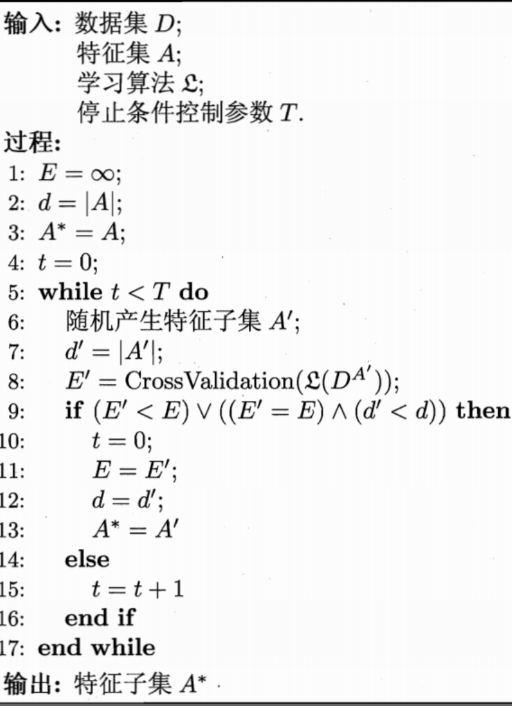
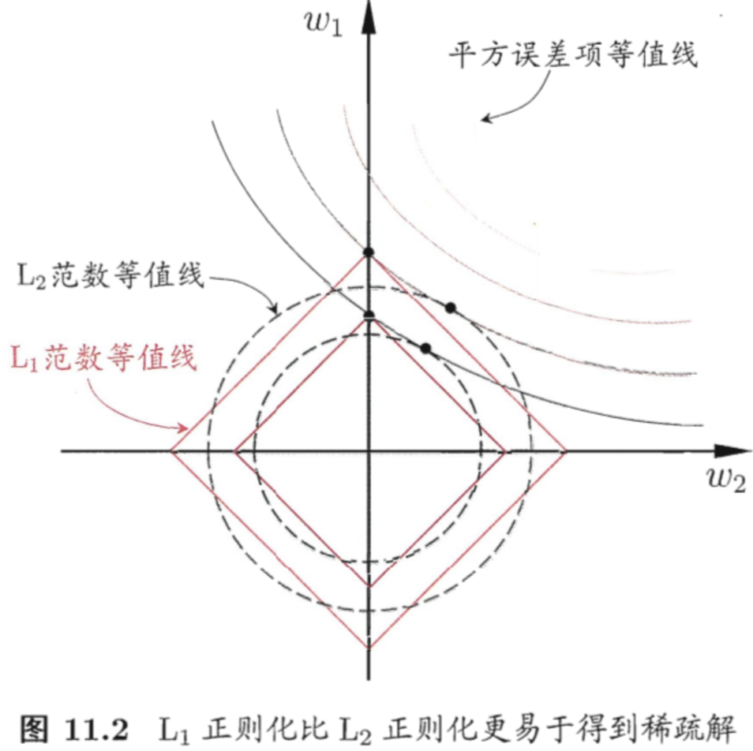

## Chapter11 特征选择与稀疏学习

### 子集搜索与评价

> 对一个学习任务来说，给定属性集，其中有些属性可能很关键、很有用，另一些属性可能没什么用，我们将属性称为**特征**

**相关特征：**对当前学习任务有用的属性，对应**无关特征**

**特征选择：**从给定的特征集合中选择出相关特征

**为什么要进行维数选择？**

* 在现实任务中经常遇到维数灾难问题，此类问题主要由属性过多造成
* 去除不相关特性往往会降低学习的难度

**注意，特征选择中所谓的无关特征是指与当前学习任务无关**

#### 子集搜索

如果没有任何领域知识作为先验假设，就需要遍历所有可能的子集，但是这在计算上是不可行的，因为会遇到组合爆炸的问题，可行的做法是产生一个**候选子集**，评价其好坏，基于评价结果产生下一个候选子集，再对其进行评价，这个过程持续进行下去，直至无法找到更好的候选子集为止。具体策略有：

* 前向搜索
* 后向搜素
* 双向搜索

以上策略均基于**贪心**

#### 子集评价

对每个候选特征子集，我们可基于训练数据集D来计算其信息增益，以此作为评价准则

#### summery

将特征子集搜索机制与子集评价机制相结合，即可得到特征选择方法。例如将前向搜索与信息熵相结合，这显然与决策树算法非常相似。事实上，决策树可用于特征选择，树结点的划分属性所组成的集合就是选择出的特征子集。其他的特征选择方法未必像决策树特征选择这么明显，但它们在本质上都是显式或隐式地结合了某种或多种子集搜索评价机制

### 过滤式选择

> 过滤式方法先对数据集进行特征选择，然后再训练学习器，特征选择过程与后续学习器无关。这相当于先用特征选择过程对初始特征进行**过滤**，再用过滤后的特征来训练模型

Relief是一种著名的过滤式特征选择方法，该方法设计了一个**相关统计量**来度量特征的重要性。

该统计量是一个向量，其每个分量分别对应于一个初始特征，而特征子集的重要性则是由子集中每个特征所对应的相关统计量分量之和来决定。Relief的关键是如何确定相关统计量

给定训练集$\{(\mathbf{x}_1,y_1),(\mathbf{x}_2,y_2),...,(\mathbf{x}_m,y_m)\}$，对每个示例$\mathbf{x}_i$，Relief先在$\mathbf{x}_i$的同类样本中寻找其最近邻$\mathbf{x}_{i,nh}$，称为**猜中近邻（near-hit）**，再从$\mathbf{x}_i$的异类样本中寻找其最近邻$\mathbf{x}_{i,nm}$称为**猜错近邻（near-miss）**，然后，相关统计量对应于属性j的分量为：
$$
\delta^j=\sum_i-diff(x_i^j,x_{i,nh}^j)^2+diff(x_i^j,x_{i,nm}^j)^2\ \ \ \ (1)
$$
其中$x_a^j$表示样本$\mathbf{x}_a$在属性j上的取值，$diff(x_a^j,x_b^j)$取决于属性j的类型：

* 若属性j为离散型，则$x_a^j=x_b^j时diff(x_a^j,x_b^j)=0$，否则为1
* 若属性j为连续性，则$diff(x_a^j,x_b^j)=|x_a^j-x_b^j|$，注意$x_a^j，x_b^j$已经规范化到[0, 1]区间

从式（1）可以看出，若$\mathbf{x}_i$与其猜中近邻$\mathbf{x}_{i,nh}$在属性j上的距离小于$\mathbf{x}_i$与其猜错近邻$\mathbf{x}_{i,nm}$的距离，则说明属性j对区分同类与异类样本是有益的，于是增大属性j所对应的统计量分量；反之说明属性j其负面作用，于是减小属性j所对应的统计量分量。最后，对基于不同样本得到得到估计结果进行平均，就得到个属性的相关统计量分量，分量值越大，则对应属性的分类能力就越强。

Relief是为二分类问题设计的，其拓展变体Relief-F能处理多分类问题，与Relief不同的地方在于在第k类之外的**每个类**中找到一个$\mathbf{x}_i$的最近邻示例作为猜错近邻，记为$\mathbf{x}_{i,l,nm}(l=1,2,...,|\mathcal{Y}|;l\ne k)$，于是，相关统计量对应于属性j的分量为：
$$
\delta^i=\sum_{i}-diff(x_i^j,x_{i,nh}^j)^2+\sum_{l\ne k}(p_l\times diff(x_i^j,x_{i,nm}^j)^2)
$$
其中$p_l$为第$l$类样本在数据集D中所占的比例

### 包裹式选择

> 包裹式特征选择直接吧最终将要使用的学习器的性能作为特征子集的评价准则，换言之，包裹式特征选择的目的就是为给定学习器选择最有利于其性能、量身定做的特征子集

* 最终学习器的性能好于过滤式特征选择
* 在特征选择过程中需多次训练学习器，因此计算开销比过滤式特征选择大得多

LVM是一个典型的包裹式特征选择方法，它在拉斯维加斯方法框架下使用随机策略进行子集搜索，并以最终分类器的误差为特征子集评价标准，算法描述如下：

### 嵌入式选择与L1正则化

> 嵌入式特征选择是将特征选择过程与学习器训练过程融为一体，两者在同一个优化过程中完成，即在学习器训练过程中自动地进行了特征选择

L1和L2范数都有助于降低过拟合风险，但前者会带来一个额外的好处：它比后者更易于获得**稀疏解**，即它求得的$\boldsymbol{\omega}$会有更少的非零分量。

如上图，采用L1范数时平方误差项等值线与正则化项等值线的交点常出现在坐标轴上，即$\omega_1或\omega_2$为0，而在采用L2范数时，两者的焦点常出现在某个象限中，即$\omega_1或\omega_2$均非0，，换言之，采用L1范数比L2范数更易于得到稀疏解。

注意到$\boldsymbol{\omega}$取得稀疏解意味着初始的d个特征中仅有对应着$\boldsymbol{\omega}$的非零分量的特征才会出现在最终模型中，于是求解L1范数正则化的结果是得到了仅采用的一部分初始特征的模型。

#### L1正则化问题的求解可使用近端梯度下降

pass

### 稀疏表示与字典学习

> 特征选择所考虑的问题是特征具有**稀疏性**，另一种稀疏性：D所对应的矩阵中存在很多零元素，但这些零元素并不是以整列、整行的形式存在的，例如：文档分类任务

当样本具有这样的稀疏表达形式的时候，对学习任务来说会有不少好处；稀疏样本也不会造成存储上的巨大负担，因为稀疏矩阵已有很多高校的存储方法

**字典学习：**为普通稠密表达的样本找到合适的字典，将样本转化为合适的稀疏表示形式，从而使学习任务得以简化，模型复杂度得以降低，亦称**稀疏编码**；字典学习更侧重于学得字典的过程，而稀疏编码则更侧重于对样本进行稀疏表达的过程。

#### 字典学习

pass

### 压缩感知

> 如何利用信号本身所具有的稀疏性，从部分观测样本中恢复原信号。通常认为，压缩感知分为**感知测量**和**重构恢复**这连个阶段；感知测量关注如何对原始信号进行处理以获得稀疏样本表示，涉及傅里叶变换、小波变换以及字典学习、稀疏学习等；重构恢复关注的是如何基于稀疏性从少量观测中恢复原信号，这是压缩感知的精髓

