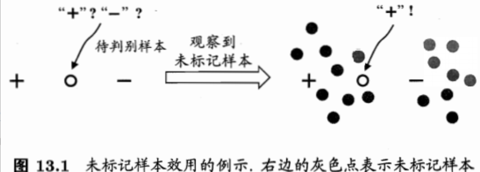
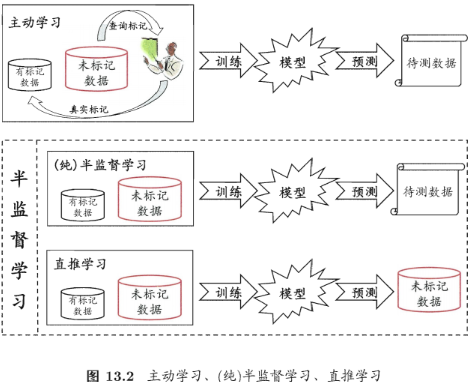
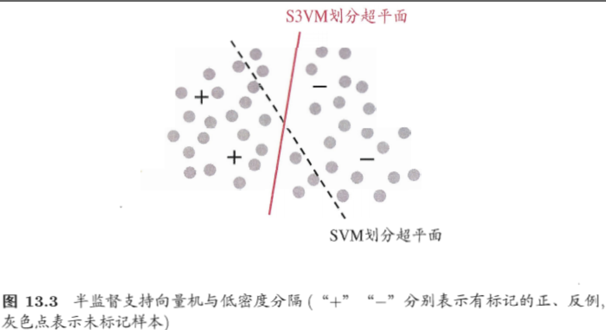
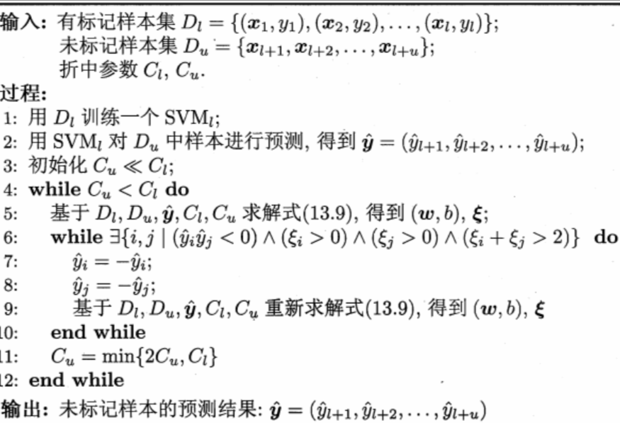
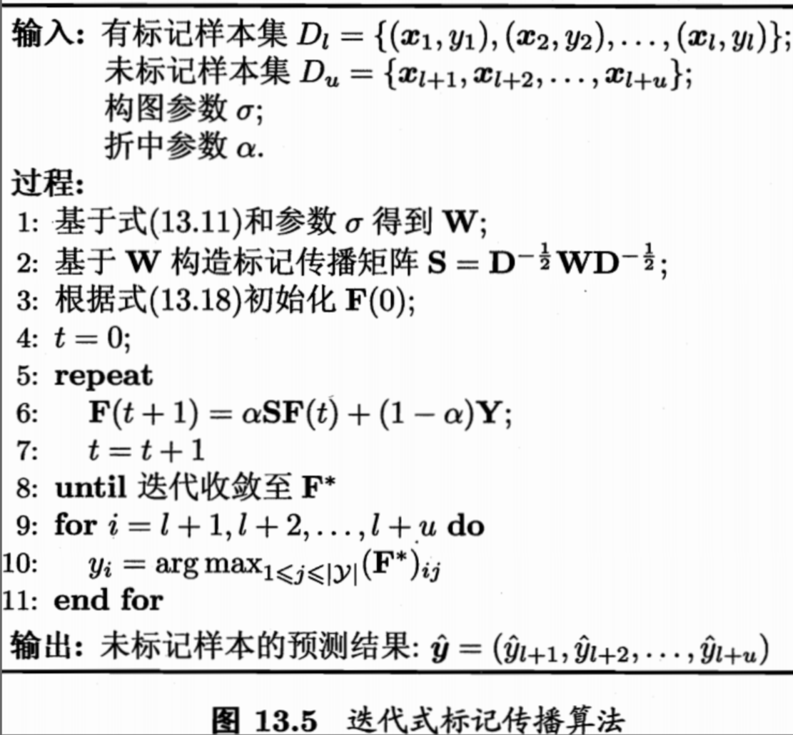
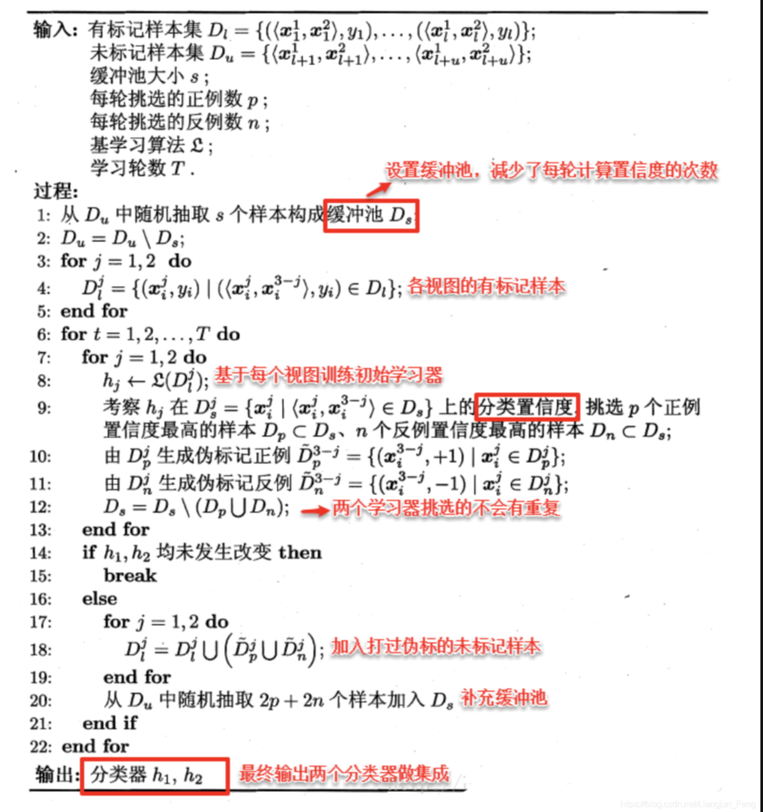
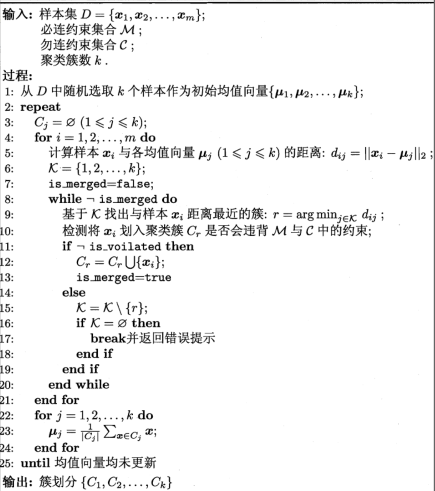
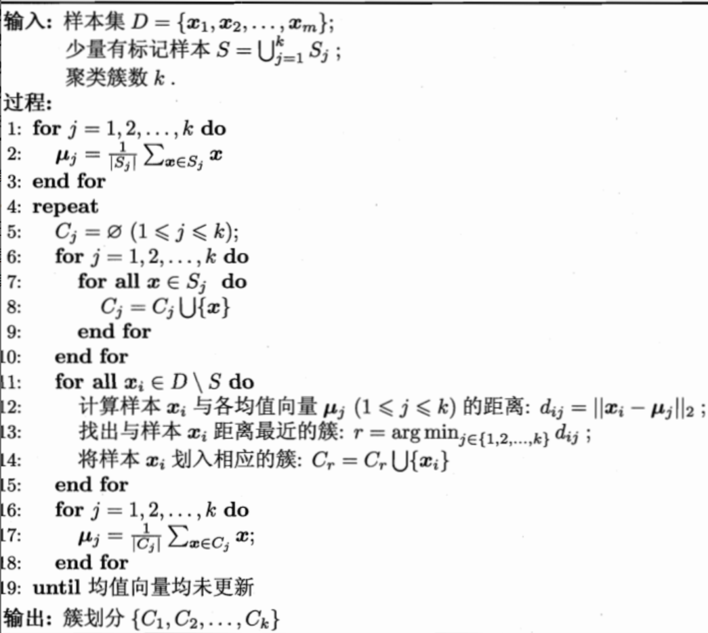

## Chapter13 半监督学习

### 未标记样本

形式化的看，有训练样本集合$D_l=\{(\mathbf{x_1},y_1),...,(\mathbf{x_l},y_l)\}$，这$l$个样本的类别标记已知，称为**有标记**；

此外有$D_u=\{(\mathbf{x_{l+1}},y_{l+1}),...,(\mathbf{x_{l+u}},y_{l+u})\},l<<u$，这u个样本的类别标记未知，称为**未标记**样本。

**主动学习：**先用$D_l$训练一个模型，那这个模型去地里挑一个瓜，询问瓜农好不好，然后把这个新获得的有标记样本加入$D_l$中重新训练一个模型，再去挑瓜......这样，如果每次都挑出对改善模型性能帮助很大的瓜，则只需要询问瓜农比较少的瓜就能构建出比较强的模型

主动学习引入了额外的**专家知识**，通过与外界的交互来将部分未标记样本转变为有标记样本

**半监督学习：**让学习器不依赖外界交互、自动地利用未标记样本来提升学习性能

要利用未标记样本，要将未标记样本所揭示的数据分布信息与类别标记相联系的假设：

* 聚类假设：假设数据存在簇结构，同一个簇的样本属于同一个类别
* 流形假设：假设数据分布在一个流形结构上，邻近的样本拥有相似的输出值，**邻近**程度常用**相似**程度来刻画
* 本质都是**相似的样本拥有相似的输出**

**纯半监督学习：**基于**开放世界**的假设，假定训练数据中的未标记样本并非带预测的数据

**直推学习：**基于**封闭世界**的假设，假定学习过程中所考虑从的未标记样本恰是待预测数据

### 生成式方法

> 生成式方法是直接基于生成式模型的方法，此类方法假设所有数据都是由同一个潜在的模型生成的。这个假设使得我们能通过潜在模型的参数将未标记数据与学习目标联系起来，而未标记数据则可看做模型的缺失参数，通常可基于EM算法进行极大似然估计求解。

高斯混合模型参数估计可以用EM算法求解。

### 半监督SVM

> 在不考虑未标记样本时，支持向量机试图找到最大间隔划分超平面，而在考虑未标记样本时，S3VM试图找到能将两类有标记样本分开，且穿过数据低密度区域的划分超平面
>
> 这里的假设是**低密度分隔**，显然这是聚类假设在考虑了线性超平面划分后的推广

**TSVM：**与标准SVM一样，TSVM也是针对二分类问题的学习方法，TSVM试图考虑对未标记样本进行各种可能的标记指派，即尝试将每个未标记样本分别作为正例或反例，然后在所有这些结果中，寻求一个在所有样本上间隔最大化的划分超平面，一旦划分超平面的以确定，未标记样本的最终标记指派就是其预测的结果。

这是一个穷举的过程，考虑优化策略：局部搜索来迭代式的寻找近似解。

### 图半监督学习

> 给定一个数据集，我们可将其映射为一个图：
>
> * 图的结点对应于数据集中的每个样本
> * 图中结点之间的边表示两个样本之间的相似度很高
> * 图的边的强度正比于样本之间的相似度
>
> 将有标记样本所对应的结点想想为染过色，而未标记样本所对应的节点尚未染色，于是半监督学习就对应于**颜色**在图上扩散或传播的过程，由于一个图对应了一个矩阵，这就是的我们能基于矩阵运算来进行半监督学习算法的推导和分析

多分类问题的标记传播方法的算法描述如下：

### 基于分歧的方法

> 与生成式方法、半监督SVM、图半监督SVM等基于**单学习器**利用未标记数据不同，基于分歧的方法使用多学习器，而学习器之间的**分歧**对未标记数据的利用至关重要

**多视图数据：**一个数据对象同时拥有多个属性集，每个属性集构成了一个视图。例如对于一部电影来说，它拥有多个属性集：图像画面信息所对应的属性集、声音信息所对应的属性集、字母信息所对应的属性集。考虑其中两个属性集，一个电影片段可以表示为：$(<\mathbf{x^1,\mathbf{x^2}}>,y)$

**不同视图具有的相容性：**其所包含的关于输出空间$\mathcal{Y}$的信息是一致的，在相容性的基础上，不同视图信息的互补性会给学习器的构建带来很多便利

协同训练算法描述如下：

基于分歧的方法只需要采用合适的基学习器，就能较少的收到模型假设、损失函数非凸性和数据规模问题的影响

### 半监督聚类

> 聚类是一种典型的无监督学习任务，然而在现实聚类任务中我们往往能获得一些额外的监督信息

聚类任务中获得的监督信息大致有两种类型：

* 必连：样本必须属于同一个簇，勿连：样本必不属于同一个簇
* 少量的标记样本

约束k均值算法：

约束种子k均值算法

