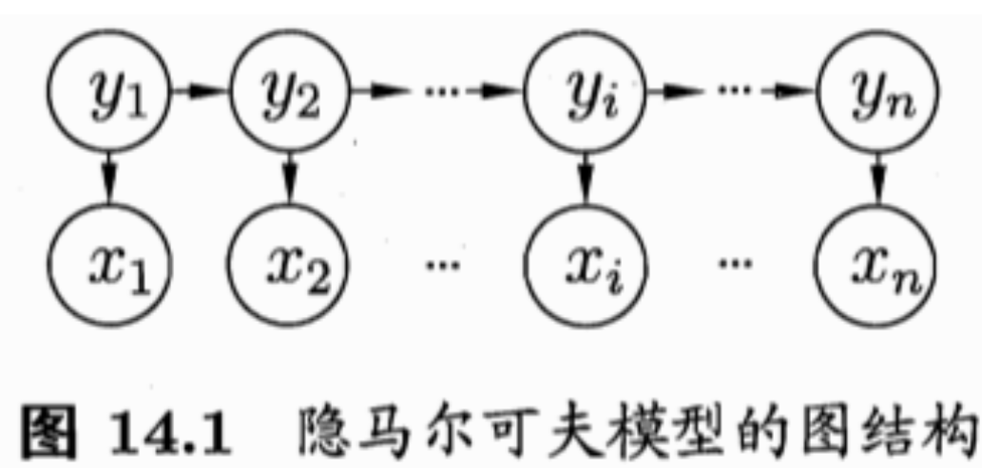
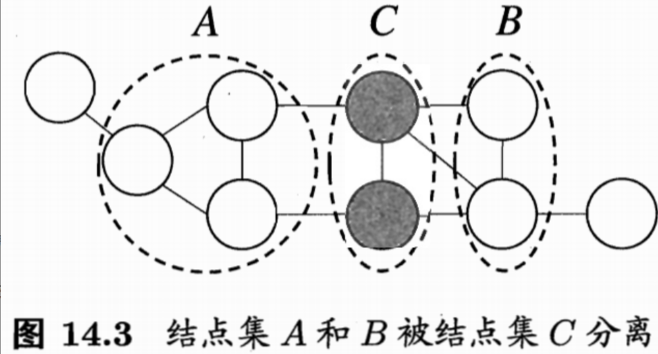

## Chapter14 概率图模型

### 隐马尔可夫模型

概率模型提供了一种描述框架，将学习任务归结于计算变量的概率分布。

在概率模型中，利用已知变量推测未知变量的分布称为**推断**

**概率图模型：**是一类用图来表达变量相关关系的概率模型。大致可分为两类：

* 使用有向无环图表示变量间的依赖关系，称为有向图模型或贝叶斯网
* 使用无向图表示变量间的相关关系，称为无向图模型或马尔可夫网

**隐马尔可夫模型：**是结构最简单的动态贝叶斯网，这是一种著名的有向图模型，主要用于时序建模，在语音识别、自然语言处理等领域有广泛应用。

模型中的变量分为两组：

* 第一组是状态变量$\{y_1,y_2,...,y_n\}$，其中$y_i\in \mathcal{Y}$表示第i时刻的系统状态，通常假设状态变量是隐藏的、不可被观测的，亦称隐变量
* 第二组是观测变量$\{x_1,x_2,...,x_n\}$，其中$x_i\in \mathcal{X}$表示第i时刻的观测值

**马尔科夫链：**系统下一时刻的状态仅有当前状态决定，不依赖于以往的任何状态

基于这种依赖关系，所有变量的联合概率分布为：
$$
P(x_1,y_1,...,x_n,y_n)=P(y_1)P(x_1|y_1)\prod_{i=2}^nP(y_i|y_{i-1})P(x_i|y_i)
$$
除了结构信息，要确定一个隐马尔可夫模型还需要以下三组参数：

* 状态转移概率：模型在各个状态间转换的概率，通常记为矩阵$A=[a_{ij}]_{N\times N}$，其中
  $$
  a_{ij}=P(y_{t+1}=s_j|y_t=s_i)
  $$

* 输出观测概率：模型根据当前状态获得各个观测值的概率，通常记为矩阵$B=[b_{ij}]_{N\times N}$，其中
  $$
  b_{ij}=P(x_t=o_j|y_t=s_i)
  $$

* 初始状态概率，模型在初始时刻各状态出现的概率，通常记为$\pi=(\pi_1,\pi_2,...,\pi_N)$，其中
  $$
  \pi_i=P(y_1=s_i)\ \ \ \ 1 \le i \le N
  $$

在实际应用中，常关注隐马尔可夫模型的三个基本问题：

* 如何评估模型与观测序列之间的匹配程度
* 如何根据观测序列推断出隐藏的模型状态
* 如何训练模型使其能最好地描述观测数据

### 马尔可夫随机场

> 一种著名的无向图模型，图中每个节点表示一个或一组变量，节点之间的边表示两个变量之间的依赖关系

**团**：对于图中的一个自己，若其中任意两节点都有边连接，则称该节点子集为一个团

**极大团：**若在一个团中加入另外任何一个节点都不再形成团，则称该团为极大团

在马尔可夫随机场中，多个变量之间的联合概率分布能基于团分解为多个因子的乘积，每个因子仅与一个团相关，具体来说，对于n个变量$\mathbf{x}=\{x_1,x_2,...,x_n\}$，所有团构成的集合为$\mathcal{C}$，与团$Q\in \mathcal{C}$对应的变量集合记为$\mathbf{x}_Q$，则联合概率$P(\mathbf{x})$定义为：
$$
P(\mathbf{x})=\cfrac{1}{Z}\prod_{Q\in \mathcal{C}}\psi_Q(\mathbf{x}_Q)\\
其中，\psi_Q为与团Q对应的势函数，用于对团Q中的变量关系进行建模\\
Z=\sum_{\mathbf{x}}\prod_{Q\in \mathcal{C}}\psi_Q(\mathbf{x}_Q)为规范化因子，以确保P(\mathbf{x})是被正确定义的概率
$$
联合概率$P(\mathbf{x})$可基于极大团来定义，假定所有极大团构成的集合为$\mathcal{C}^*$，则有：
$$
P(\mathbf{x})=\cfrac{1}{Z^*}\prod_{Q\in \mathcal{C}^*}\psi_Q(\mathbf{x}_Q)
$$

如图，若从结点集A中的结点到B中的结点都必须经过结点集C中的结点，则称结点集A和B被结点集C分离，C称为**分离集**，对马尔科夫随机场，有：

* 全局马尔可夫性：给定两个变量子集的分离集，则这两个变量子集条件独立

势函数是非负函数，因此指数函数常被用于定义势函数：
$$
\psi_Q(\mathbf{x}_Q)=e^{-H_Q(\mathbf{x}_Q)}
$$

### 条件随机场

> 是一种判别式无向图模型，对条件分布进行建模。条件随机场试图对多个变量在给定观测值后的条件概率进行建模。
