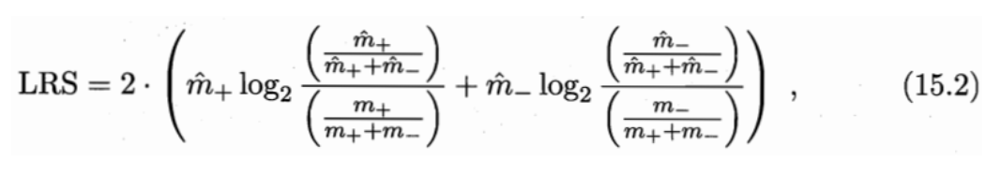
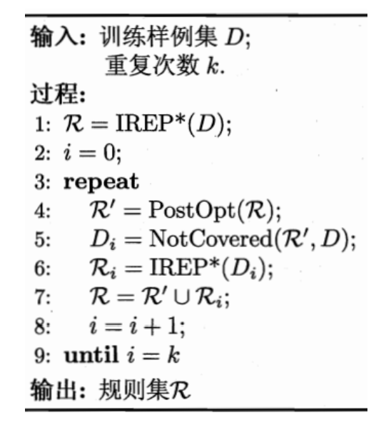

## Chapter15 规划学习

### 基本概念

机器学习中的**“规则”(rule)**通常是指语义明确、能描述数据分布所隐含的客观规律或领域概念，可写成“若……，则……”形式的**逻辑规则** [Fiirnkranz et al., 2012]。**"规则学习” (rule learning)**是从训练数据中学习出一组能用于对未见示例进行判别的规则。

形式化地看，一条规则形如

其中**逻辑蕴含符号**“←”右边部分称为**“规则体” (body)**,表示该条规则的前提，左边部分称为**“规则头” (head)**,表示该条规则的结果。规则体是由**逻辑文字(literal)fk**组成的**合取式(conjunction)**,其中**合取符号**用**“^”**来表示"并且”。每个文字**fk**都是对示例属性进行检验的布尔表达式，例如“(色泽=乌黑)”或“(根蒂=硬挺)” 。L是规则体中逻辑文字的个数，称为规则的**长度**。规则头的“㊉”同样是逻辑文字，一般用来表示规则所判定的目标类别或概念, 例如“好瓜”。这样的逻辑规则也被称为“**if-then规则**”。

与神经网络、支持向量机这样的“黑箱模型”相比，规则学习具有更好的**可解释性**，能使用户更直观地对判别过程有所了解。另一方面，数理逻辑具有极强的**表达能力**，绝大多数人类知识都能通过**数理逻辑**进行简洁的刻画和表达。例如“父亲的父亲是爷爷”这样的知识不易用函数式描述，而用**一阶逻辑**则可方便地写为“爷爷(X,Y) ←父亲(X,Z)^父亲(Z,Y)” ,因此，规则学习能更自然地在学习过程中引入**领域知识**。此外，逻辑规则的**抽象描述能力**在处理一些高度复杂的AI任务时具有显著的优势，例如在问答系统中有时可能遇到非常多、甚至无穷种可能的答案，此时若能基于逻辑规则进行抽象表述或者推理, 则将带来极大的便利。

符合规则的样本称为被该规则**“覆盖” (cover)**。

显然，规则集合中的每条规则都可看作一个子模型，规则集合是这些子模型的一个**集成**。当同一个示例被判别结果不同的多条规则覆盖时，称发生了**“冲突”(conflict)**,解决冲突的办法称为**"冲突消解” (conflict resolution** [ˌrezəˈluːʃn]**)**。常用的冲突消解策略有**投票法、排序法、元规则法**等。

**投票法**是将判别相同的规则数最多的结果作为最终结果。

**排序法**是在规则集合上定义一个顺序，在发生冲突时使用排序最前的规则；相应的规则学习过程称为**“带序规则” (ordered rule)学习**或**“优先级规则” (priority rule)学习**。

**元规则法**是根据领域知识事先设定一些**“元规则”(**[ˈmɛtə] **meta-rule)**,即关于规则的规则，例如“发生冲突时使用长度最小的规则”，然后根据元规则的指导来使用规则集。

此外，从训练集学得的规则集合也许不能覆盖所有可能的未见示例。规则学习算法通常会设置一条**“默认规则"(default rule)**,由它来处理规则集合未覆盖的样本；例如为R增加一条默认规则：“未被规则1, 2覆盖的都不是好瓜”。（亦称“缺省规则”，可认为是一种特殊的元规则）

从形式语言**表达能力**而言，规则可分为两类：**“命题规则” (propositional mle)**和“**一阶规则” (first-order rule)。**前者是由**“原子命题” (propositional atom)**和**逻辑连接词**“与”^、“或”(V)、“非”( ¬ )和“蕴含”(←)构成的简单陈述句；后者的基本成分是能描述事物的属性或关系的“**原子公式”(atomic formula)**。一阶规则能表达复杂的关系，因此也被称为“关系型规则”(relational rule)。

从形式语言**系统**的角度来看，命题规则是一阶规则的特例，因此一阶规则的学习比命题规则要复杂得多。

### 序贯覆盖

规则学习的目标是产生一个能覆盖尽可能多的样例的规则集。最直接的做法是“**序贯覆盖” (sequential covering)**,即逐条归纳：在训练集上每学到一条规则，就将该规则覆盖的训练样例去除，然后以剩下的训练样例组成训练集重复上述过程。由于每次只处理一部分数据，因此也被称为**“分治” (separate-and-conquer)**。

最简单的做法是从空规则“㊉开始，将正例类别作为规则头，再逐个遍历训练集中的每个属性及取值，尝试将其作为逻辑文字增加到规则体中，若能使当前规则体仅覆盖正例，则由此产生一条规则，然后去除已被覆盖的正例并基于剩余样本尝试生成下一条规则。

基于**穷尽搜索**的做法在属性和候选值较多时会由于**组合爆炸**而不可行。现实任务中一般有两种策略来产生规则：

第一种是**“自顶向下”（top-down）**,即从比较**一般**的规则开始，逐渐添加新文字以缩小规则覆盖范围，直到满足预定条件为止；亦称为**“生成-测试”（generate-then-test）法**，是规则逐渐**“特化” （specialization）**的过程。

第二种策略是“**自底向上”（bottom-up）**,即从比较**特殊**的规则开始，逐渐删除文字以扩大规则覆盖范围，直到满足条件为止；亦称为**“数据驱动” （data-driven）**法，是规则逐渐“**泛化” （generalization）**的过程。

第一种策略是覆盖范围从大往小搜索规则，通常容易产生泛化性能较好的规则，鲁棒性较强，常用于命题规则学习。

第二种策略覆盖范围从小往大，适合于训练样本较少的情形，噪声较小，在一阶规则学习这类假设空间非常复杂的任务上使用较多。

**序贯覆盖法**简单有效，几乎所有规则学习算法都以它为基本框架。它能方便地推广到多分类问题上，只需将每类分别处理即可：当学习关于第c类的规则时，将所有属于类别c的样本作为正例，其他类别的样本作为反例。

### 剪枝优化

**规则生成本质上是一个贪心搜索过程**，需有一定的机制来缓解**过拟合**的风险，最常见的做法是**剪枝（pruning** [ˈpruːnɪŋ]**）**。与决策树相似，剪枝可发生在规则生长过程中，即**“预剪枝”**，也可发生在规则产生后，即**“后剪枝”**：通常是基于某种**性能度量指标**来评估增/删**逻辑文字**前后的规则性能，或增/删**规则**前后的规则集性能，从而判断是否要进行剪枝。

剪枝还可借助**统计显著性检验**来进行。例如**CN2算法**［Clark and Niblett, 1989］在预剪枝时，假设用规则集进行预测必须显著优于直接基于训练样例集后验概率分布进行预测。为便于计算，CN2使用了**似然率统计量（Likelihood Ratio Statistics,简称LRS）**。

这实际上是一种信息量指标，衡量了规则（集）覆盖样例的分布与训练集经验分布的差别：LRS越大说明釆用规则（集）进行预测与直接使用训练集正、反例比率进行猜测的差别越大；LRS越小，说明规则（集）的效果越可能仅是偶然现象。在数据量比较大的现实任务中，通常设置为在LRS很大（例如0.99）时CN2算法才停止规则（集）生长。

后剪枝最常用的策略是**"减错剪枝”(Reduced Error Pruning,简称REP)** [Brunk and Pazzani, 1991],其基本做法是：将样例集划分为**训练集**和**验证集**（规则学习中常称为“**生长集"(growing set)**和 **"剪枝集"(pruning set)**）, 从训练集上学得规则集R后进行**多轮剪枝**，在每一轮穷举所有可能的剪枝操作，包括删除规则中某个文字、删除规则结尾文字、删除规则尾部多个文字、 删除整条规则等，然后用验证集对剪枝产生的所有候选规则集进行评估，保留最好的那个规则集进行下一轮剪枝，如此继续，直到无法通过剪枝提高验证集上的性能为止。

REP剪枝通常很有效[Brunk and Pazzani, 1991],但其复杂度是0( �4 ), m为训练样例数目。**IREP (Incremental REP)** [Fiirnkranz and Widmer, 1994] 将复杂度降到O(����2� ),其做法是：在生成每条规则前，先将当前样例集划分为训练集和验证集，在训练集上生成一条规则**r**,立即在验证集上对其进行REP剪枝，得到规则r’；将r’覆盖的样例去除，在更新后的样例集上重复上述过程。显然，REP是针对规则集进行剪枝，而IREP仅对单条规则进行剪枝, 因此后者比前者更高效。

若将剪枝机制与其他一些后处理手段结合起来对规则集进行优化，则往往能获得更好的效果。以著名的规则学习算法**RIPPER** [Cohen, 1995]为例，其泛化性能超过很多**决策树算法**，而且学习速度也比大多数决策树算法更快，奥妙就在于将剪枝与后处理优化相结合。（RIPPER 全称 Repeated Incremental Pruning to Produce Error Reduction, WEKA中的实现称为JRIP）

RIPPER算法描述如图所示。它先使用IREP*剪枝机制生成规则集R。IREP* [Cohen, 1995]是IREP的改进。

为什么RIPPER的优化策略会有效呢？原因很简单：最初生成R的时候, 规则是按序生成的，每条规则都没有对其后产生的规则加以考虑，这样的贪心算法本质常导致算法陷入**局部**最优；RIPPER的后处理优化过程将R中的所有规则放在一起重新加以优化,恰是通过**全局**的考虑来缓解贪心算法的局部性, 从而往往能得到更好的效果[Fiirnkranz et al., 2012]。

### 一阶规则学习

受限于命题逻辑表达能力，命题规则学习难以处理对象之间的**“关系”(relation)**,而关系信息在很多任务中非常重要。

数据直接描述了样例间的关系，称为**“关系数据”(relational data)**,其中由原样本属性转化而来的“色泽更深” “根蒂更蜷”等原子公式称为**“背景知识” (background knowledge)**，而由样本类别转化而来的关于“更好”“更好”的原子公式称为**关系数据样例(examples)**。

**一阶规则学习**能容易地引入领域知识，这是它相对于**命题规则学习**的另一大优势。在命题规则学习乃至一般的统计学习中，若欲引入领域知识，通常有两种做法：在现有属性的基础上基于领域知识构造出新属性，或基于领域知识设计某种函数机制(例如正则化)来对假设空间加以约束。然而，现实任务中并非所有的领域知识都能容易地通过**属性重构**和**函数约束**来表达。

**FOIL (First-Order Inductive Learner)**[Quinlan, 1990]是著名的**一阶规则学习算法**，它遵循**序贯覆盖**框架且采用**自顶向下**的规则归纳策略，与15.2节中的命题规则学习过程很相似。但由于逻辑变量的存在，FOIL在规则生成时需考虑不同的变量组合。

FOIL可大致看作**命题规则学习**与**归纳逻辑程序设计**之间的过渡，其自顶向下的规则生成过程不能支持函数和逻辑表达式嵌套，因此规则表达能力仍有不足；但它是把命题规则学习过程通过变量替换等操作直接转化为一阶规则学习，因此比一般归纳逻辑程序设计技术更高效。

### 归纳逻辑程序设计

**归纳逻辑程序设计(Inductive Logic Programming,简称ILP)**在**一阶规则学习**中引入了**函数**和**逻辑表达式嵌套**。一方面，这使得机器学习系统具备了更为强大的表达能力；另一方面，ILP可看作用机器学习技术来解决基于背景知识的逻辑程序(logic program)归纳，其学得的“规则”可被PROLOG等逻辑程序设计语言直接使用。

#### 最小一般泛化

pass

#### 逆归结

pass
