## Chapter16 强化学习

### 任务与奖赏

我们需要多次种瓜，在种瓜过程中不断摸索，然后才能总结出较好的种瓜策略。这个过程抽象出来，就是**强化学习**

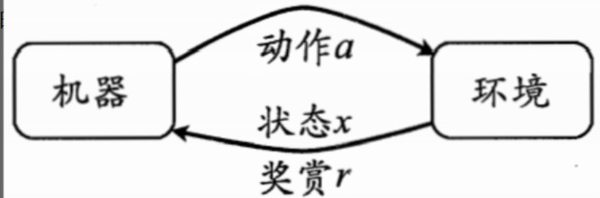

强化学习任务通常用**马尔可夫决策过程**来描述。

给西瓜浇水问题的马尔可夫决策过程：

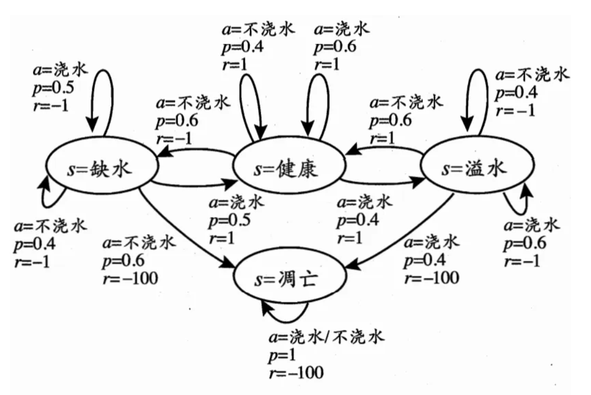

**强化学习在某种意义上可看作具有延迟标记信息的监督学习问题**

### K-摇臂赌博机

#### 探索与利用

K-摇臂赌博机有K个摇臂，赌徒在投入一个硬币后可选择按下其中一个摇臂，每个摇臂以一定的概率吐出硬币，但这个概率赌徒并不知道，赌徒的目标是通过一定的策略最大化自己的奖赏，即获得最多的硬币。

**仅探索法：**将所有的尝试机会平均分配给每个摇臂，最后以每个摇臂各自的平均吐币概率作为其奖赏期望的近似估计

**仅利用法：**按下目前最优的摇臂，若有多个摇臂同为最有，则从中随机选取一个

探索和利用这两者是矛盾的，因为尝试次数有限，加强了一方则自然会削弱另一方，这就是强化学习所面临的**探索-利用窘急**

#### $\epsilon$-贪心

$\epsilon$-贪心法基于一个概率来对探索和利用进行这种：每次尝试时，以$\epsilon$的概率进行探索，以$1-\epsilon$的概率进行利用

算法描述：

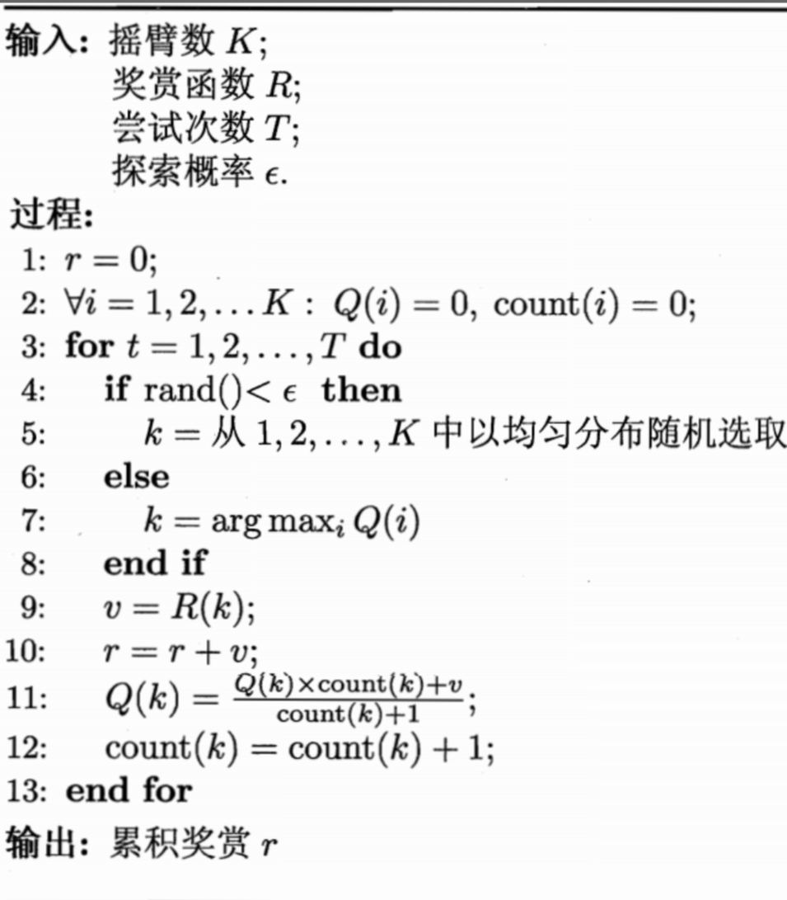

#### Softmax

Softmax算法基于当前一直的摇臂平均奖赏来对探索和利用进行这种，若各摇臂的平均奖赏相当，则选取各摇臂的概率也相当；若某些摇臂的平均奖赏明显高于其他摇臂，则他们被选取的概率也明显提高。

算法描述：

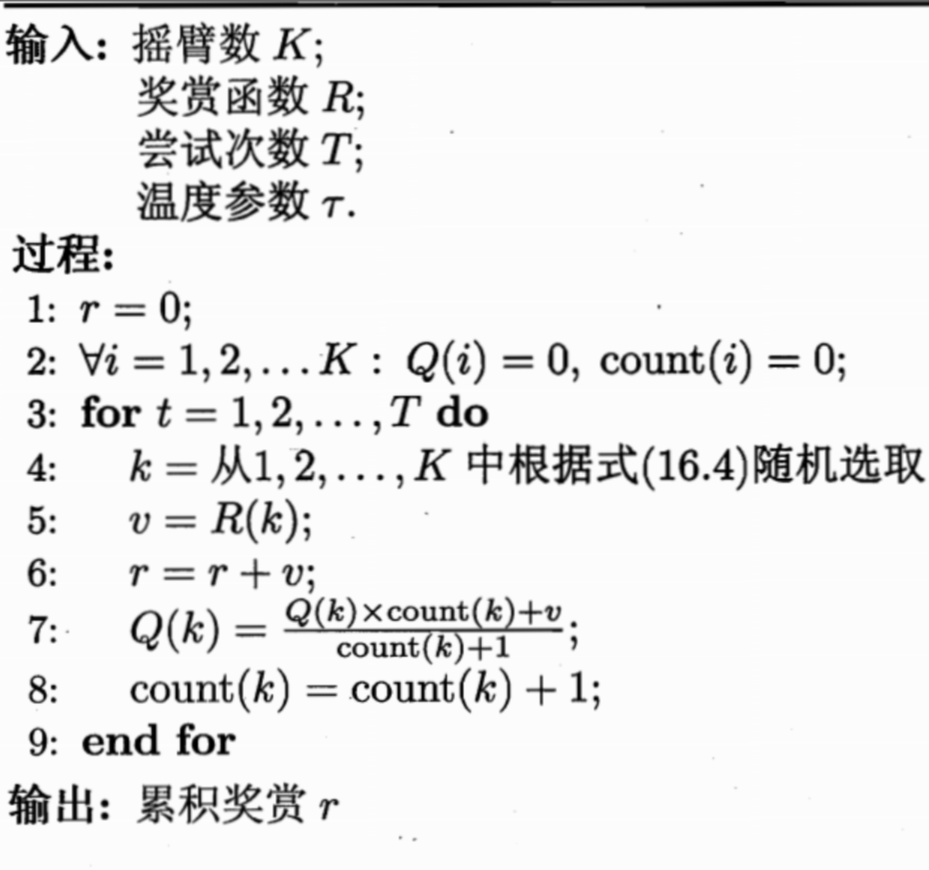

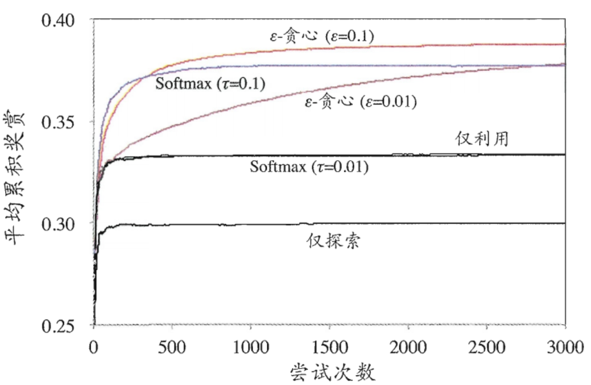

### 有模型学习

考虑多步强化学习任务，暂且先假定任务对应的马尔可夫决策过程四元组E=<X,A,P,R>均已知，这样的情形称为**“模型已知**”,即机器已对环境进行了建模，能在机器内部模拟出与环境相同或近似的状况。在已知模型的环境中学习称为**“有模型学习”(model-based learning)**。

#### 策略评估

在模型已知时，对任意策略π能估计出该策略带来的期望累积奖赏。

由累积奖赏的定义,有状态值函数

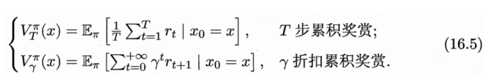

对于T步累积奖赏，用下标t表示后续执行的步数.我们有状态-动作值函数

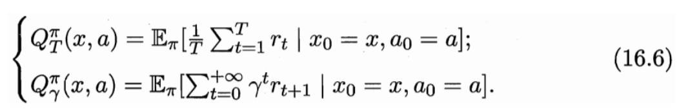

对于T步累积奖赏，只需迭代T轮就能精确地求出值函数：

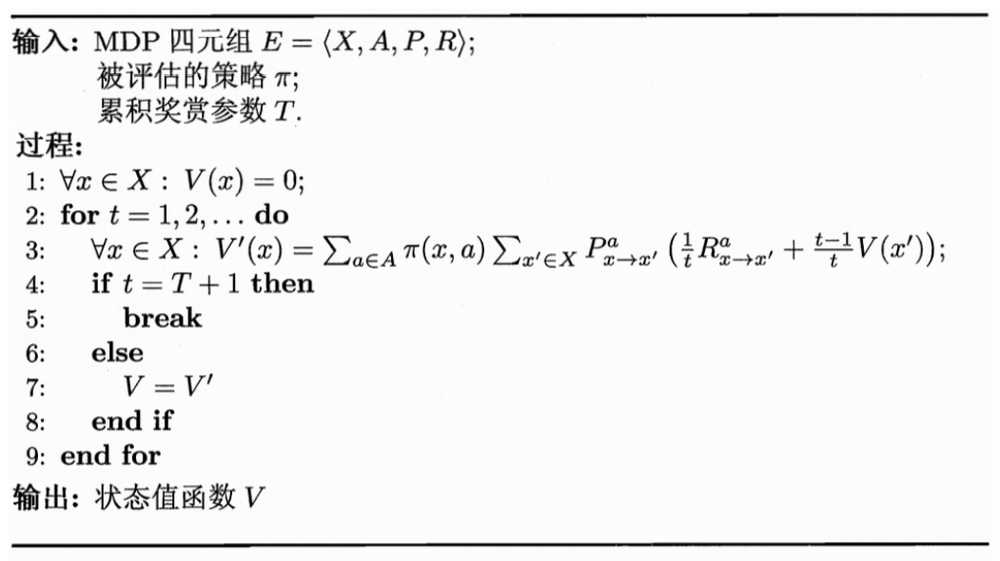

#### 策略改进

pass

#### 策略迭代与值迭代

由前两小节知道了如何评估一个策略的值函数，以及在策略评估后如何改进至获得最优策略。将这两者结合起来即可得到求解最优解的方法: 从一个初始策略(通常是随机策略)出发，先进行策略评估，然后改进策略，评估改进的策略，再进一步改进策略，……不断迭代进行策略评估和改进，直到策略 收敛、不再改变为止。这样的做法称为“**策略迭代” (policy iteration)**。

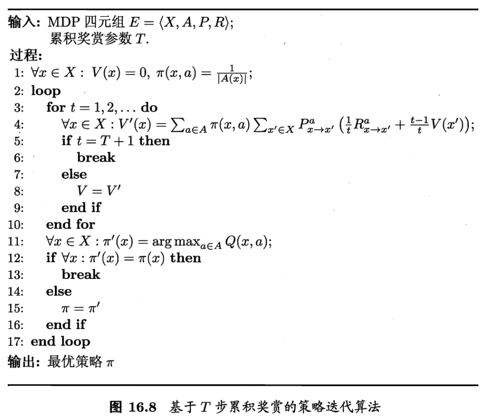

值迭代(value iteration)算法：

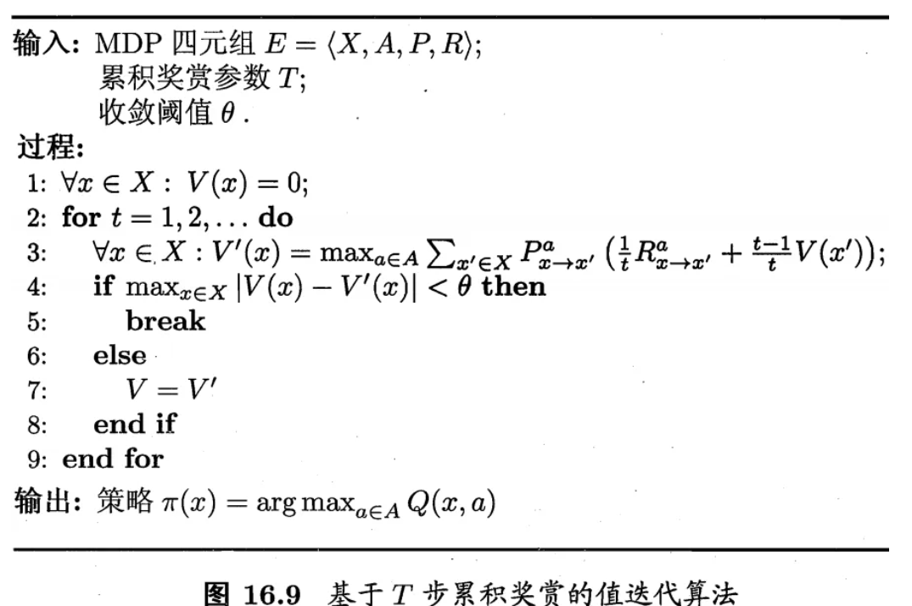

### 免模型学习

在现实的强化学习任务中，环境的转移概率、奖赏函数往往很难得知，甚至很难知道环境中一共有多少状态。若学习算法不依赖于环境建模，则称为**免模型学习**

#### 蒙特卡罗强化学习

在免模型情形下，**策略迭代算法**首先遇到的问题是策略无法评估，这是由于模型未知而导致无法做全概率展开。此时，只能通过在环境中执行选择的动作，来观察**转移的状态**和**得到的奖赏**。受K摇臂赌博机的启发，一种直接的策略评估替代方法是多次“采样”，然后求取**平均累积奖赏**来作为**期望累积奖赏**的近似，这称为**蒙特卡罗强化学习**。

**“同策略”(on-policy)蒙特卡罗强化学习算法**。算法中奖赏均值采用增量式计算，每釆样出一条轨迹，就根据该轨迹涉及的所有“状态动作”对来对值函数进行更新。

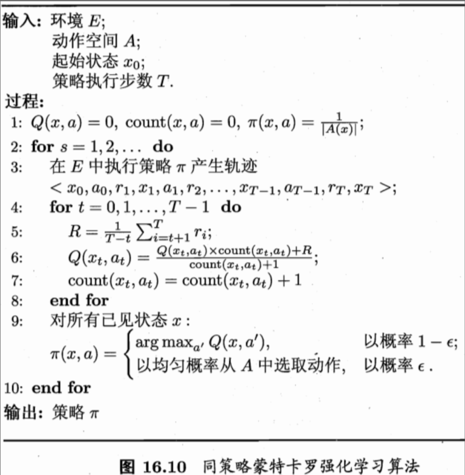

**异策略 (off-policy)蒙特卡罗强化学习算法**描述：

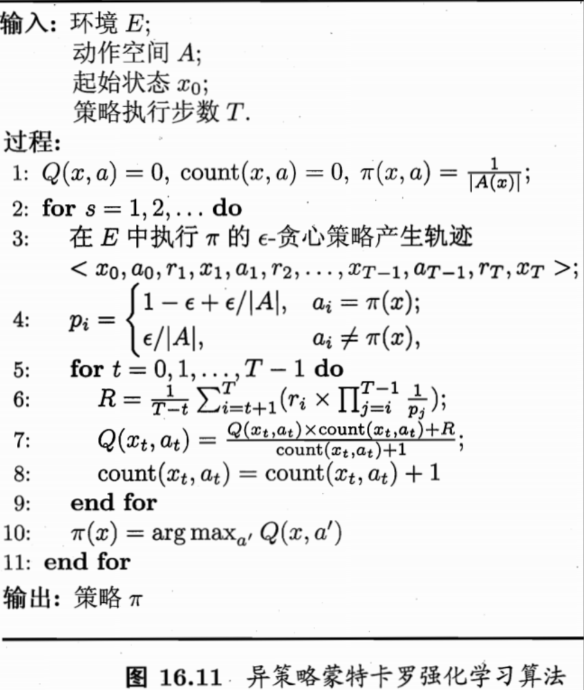

#### 时序差分学习

**时序差分 (Temporal Difference,简称TD)学习**则结合了动态规划与蒙特卡罗方法的思想，能做到更高效的免模型学习。

图16.12 的算法由于每次更新值函数需知道前一步的状态(state)、前一步的动作 (action)、奖赏值(reward)、当前状态(state)、将要执行的动作(action),由此得名为**Sarsa算法**。显然，Sarsa是一个**同策略算法**，算法中评估(第6行)、执行(第5行)的均为ε贪心策略。

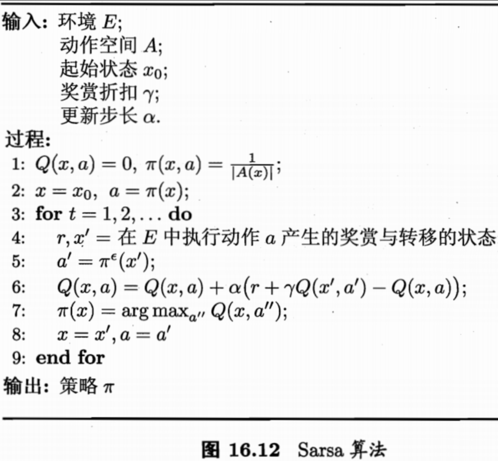

将Sarsa修改为**异策略算法**，则得到**Q-学习(Q-learning)算法**,该算法评估(第6行)的是ε贪心策略,而执行(第 5行)的是原始策略：

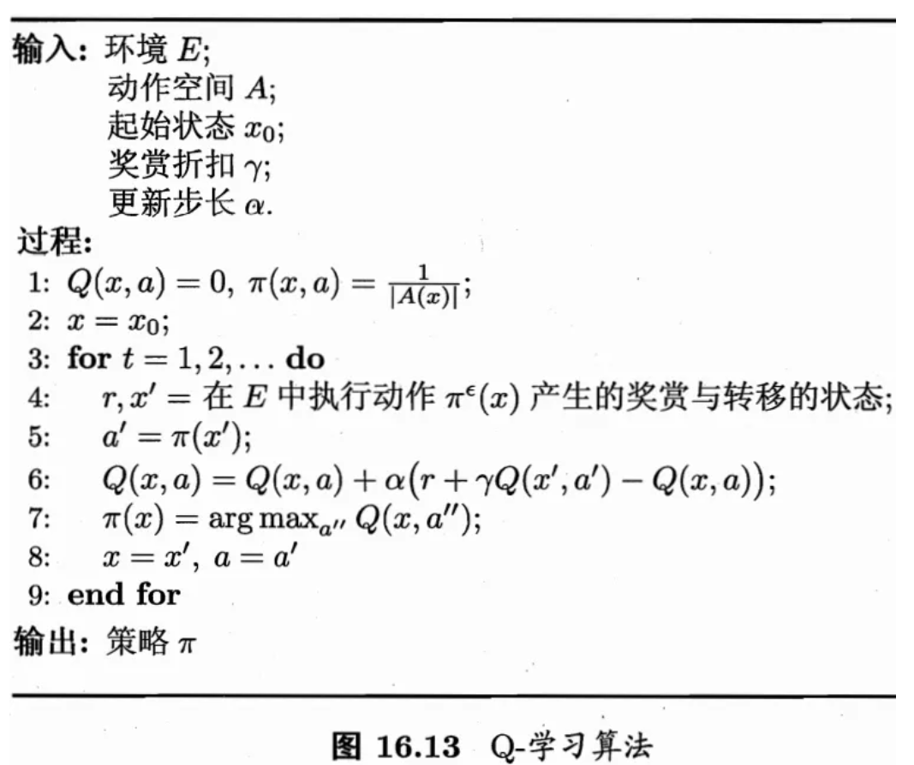

### 值函数近似

pass

### 模仿学习

在强化学习的经典任务设置中，机器所能获得的反馈信息仅有多步决策后的累积奖赏，但在现实任务中，往往能得到人类专家的决策过程范例，例如在种瓜任务上能得到农业专家的种植过程范例。从这样的范例中学习，称为**模仿学习**
