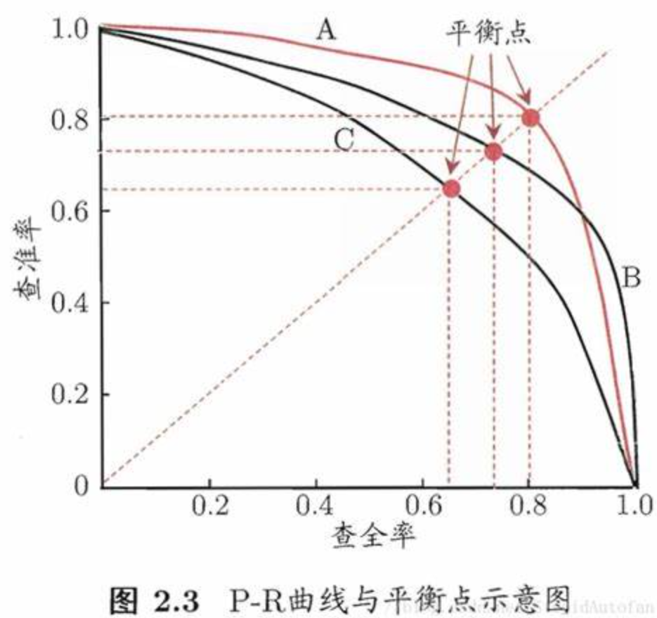
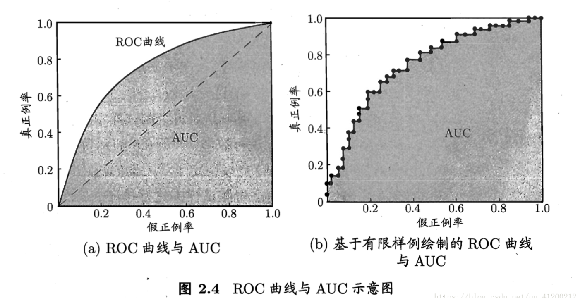
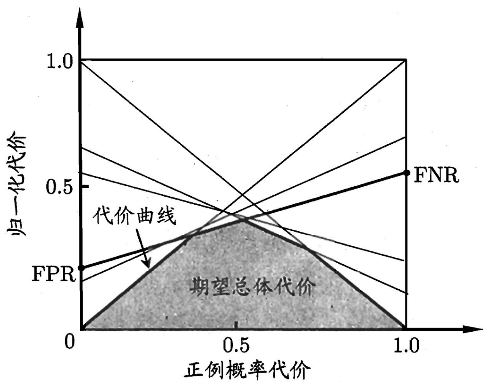

## Chapter2 模型评估与选择

### 经验误差与过拟合

样本数量为m，样本分类错误数量为a

**错误率（error rate）**：分类错误的样本数占样本总数的比例，E = a/m

**精度(accuracy)**：精度 = 1 - 错误率；(1 - a/m) x 100%

**误差（error）：**学习器的实际预测输出与样本的真实输出之间的差异

**训练误差(training error)/经验误差(empirical error)**：学习器在训练集上的误差

**泛化误差(generalization error)**：在新样本上的误差

**过拟合(overfitting)：**学习能力过于强大，以至于把训练样本所包含的不太一般的特性都学到了

**欠拟合(underfitting)**：学习能力低下

> 过拟合无法彻底避免，我们所能做的只是”缓解“

### 评估方法

> 1. 通过实验测试来对学习器的泛化误差进行评估并进而做出选择
> 2. 需要使用一个”测试集 testing set“来测试学习器对新样本的辨别能力，以测试集上的"测试误差testing error"作为泛化误差的近似
> 3. **假设**测试样本是从样本真实分布中独立同分布得到
>
> 现有一个包含m个样例的数据集$D=\{(x_1,y_1),(x_2,y_2),...,(x_m,y_m)\}$，通过对D进行适当的处理，从中产生训练集S和测试集T

#### 留出法（hold-out）

直接将数据集D划分为两个互斥的集合，其中一个作为训练集S，另一个作为测试集T，即
$$
D = S\cup T\\S\cap T=\empty
$$

> 1. 在S上训练出模型后，用T来评估其测试误差，作为对泛化误差的估计
>
> 2. 训练/测试集的划分要尽量保持数据分布的一致性，避免因数据划分过程引入额外的偏差
>
> 3. 可以采用”分层采样“来保证S、T中的样本类别比例相同
> 4. 单次留出法得到的估计结果不够可靠稳定，因此要采用若干次随即划分、重复进行实验评估后取平均值作为留出法的估计结果

**缺陷：**若训练集S太大，虽然训练出的模型接近于用D训练出的模型，但因为T较小，评估结果不够客观准确；若测试集T较大，则训练集S与D差别会更大，降低了评估结果的保真性（fidelity）。常见的划分是将2/3~4/5的样本用于训练，其余的用于测试。

#### 交叉验证法（cross validation）

先将数据集D划分为k个大小相似的互斥子集，即$D=D_1\cup D_2\cup...\cup D_k, D_i\cap D_j=\empty(i\neq j)$ 。每个自己尽可能保持数据分布的一致性，即从D中通过分层采样得到。**这里的测试集指验证集**

> 1. 每次使用k-1个子集的并集作为训练集，余下的一个子集作为测试集
> 2. 这样可以进行k次训练和测试，最终返回这k个测试结果的均值
> 3. 又称作"k折交叉验证"，k的常用取值为10、5、20

为减小因样本划分不同而引入的差别，k折交叉验证通常要随机使用不同的划分重复p次，最终的评估结果为这p次k折交叉验证结果的均值，常见的为"10次10折交叉验证"

**特例：留一法**：k = m，该方法的评估结果比较准确，但在数据集较大的时候训练m个模型的计算开销是难以忍受的（尚且未考虑调参）

#### 自助法

> 在留出法和交叉验证法中，由于保留了一部分样本用于测试，因此实际评估的模型所使用的训练集比D小，这必然会引入一些因训练样本呢规模不同而导致的估计偏差，同时留一法的计算复杂度太高。

自助法（bootstrapping）直接以自主采样（bootstrap sampling）为基础。

给定包含m个样本的数据集D，对其进行采样得到$D^{’}$：每次**随机**从D中挑选一个样本，将其拷贝放入$D^{’}$，然后再将该样本放回到初始数据集D中，使得该样本在下次采样时仍有可能被采到；该过程重复执行m次之后，我们就得到了包含m个样本的数据集$D^{’}$。

样本在m次采样中始终不被采到的概率是$(1-\cfrac{1}{m})^m$，取极限得到：
$$
\lim\limits_{m\to\infty}{(1-\cfrac{1}{m})^m}=\cfrac{1}{e}\approx0.368
$$
即通过自助采样，初始数据集D中约有36.8%的样本未出现在采集数据集$D^{'}$中，于是将$D^{'}$用作训练集，$D\backslash D^{'}$用作测试集；这样实际评估的模型与期望评估的模型都使用m个训练样本，我们仍然有数据总量约1/3的，没在训练集中出现的样本用于测试。这样的测试结果叫做”包外估计“

**缺陷**：自助法产生的数据集改变了初始数据集的分布，这会引入估计偏差，因此在初始数据量足够的时候，留出法和交叉验证发会更常用一些。

#### 调参与最终模型

学习算法中很多参数是在实数范围内取值，因此，对每种参数配置都训练出模型来是不可行的；通常做法是：对每个要设定的参数选定一个范围和变化步长，如在[0, 0.2]范围内以0.05为步长。

多个参数设定导致极大的调参工程量，参数调节对最终模型性能有关键性影响。

在模型选择完成后，学习算法和参数配置已选定，此时应用数据集D重新训练模型，该模型在训练过程中使用了所有m个样本，这是我们最终提交给用户的模型。

**验证集（validation set）**：模型评估与选择中用于评估测试的数据集。（从数据集D中产生）

**测试集**：学得模型在实际使用中遇到的数据

### 性能度量

衡量模型泛化能力的评价标准——性能度量（performance measure）。

在预测任务中给定样例集$D=\{(x_1, y_1),(x_2,y_2),...,(x_m,y_m)\}$，其中$y_i$是示例$x_i$的真实标记。要评估学习器f的性能，就要把学习器预测结果$f(x)$和真是标记y进行比较。

回归任务最常用的性能度量是“均方误差”（mean squared error）
$$
E(f;D)=\frac{1}{m}\sum_{i=1}^{m}(f(x_i) - y_i)^2\\
更一般的，对于数据分布\mathcal{D}和概率密度函数p(·)，均方误差可以描述为：\\
E(f;\mathcal{D})=\int_{x\thicksim\mathcal{D}}(f(x)-y)^2p(x)dx
$$

#### 错误率与精度

$$
对于样例集D，分类错误率定义为：\\
E(f;D)=\cfrac{1}{m}\sum_{i=1}^{m}\mathbb{I}(f(x_i)\neq y_i)\\
精度定义为：\\
acc(f;D) = \cfrac{1}{m}\sum_{i=1}^{m}\mathbb{I}(f(x_i)=y_i)=1-E(f;D)\\
更一般的，对于数据分布\mathcal{D}和概率密度函数p(·)，错误率和进度可分别描述为：\\
E(f;\mathcal{D})=\int_{x\thicksim \mathcal{D}}\mathbb{I}(f(x)\neq y)p(x)dx\\
acc(f;\mathcal{D})=\int_{x\thicksim \mathcal{D}}\mathbb{I}(f{x}=y)p(x)dx\\
=1-E(f;\mathcal{D})
$$

#### 查准率（precision）、查全率（recall）与F1

对于二分类问题，可将样例根据其真实类别与学习器预测类别的组合划分为**真正例（TP）、假正例（FP）、真反例（TN）、假反例（FN）**，显然有**样例总数=TP+FP+TN+FN**。分类结果的“混淆矩阵”如下表：

| 真实情况 | 预测结果 |      |
| -------- | -------- | ---- |
|          | 正例     | 反例 |
| 正例     | TP       | FN   |
| 反例     | FP       | TN   |

**查准率：**$P=\cfrac{TP}{TP+FP}$：在预测结果均为正例的情况中预测正确的比例

**查全率：**$R=\cfrac{TP}{TP+FN}$：在真实情况均为正例的情况下预测正确的比例

查准率和查全率是一对矛盾的变量，一般来说，查准率高时，查全率往往偏低；而查全率高时，查准率往往偏低。

将学习器的预测结果排序后，按此顺序逐个把样本作为正例进行预测，每次计算出当前的**查全率**和**查准率**，以查准率为纵轴、查全率为横轴得到P-R曲线：

在根据P-R曲线进行性能比较时，若一个学习器的PR曲线被另一个学习器的曲线完全“包住”，则可断言后者的性能优于前者；如图A的性能优于C；若发生交叉则比较PR曲线下**面积**的大小。

**平衡点BEP**：查准率=查全率

**F1**：$F1=\cfrac{2\times P\times R}{P + R}=\cfrac{2\times TP}{样例总数+TP-TN}$

**F1度量的一般形式——$F_{\beta}$**:$F_{\beta}=\cfrac{(1+\beta ^2)\times P\times R}{(\beta ^2 \times P) + R}$ 其中，$\beta>0$度量了查全率对查准率的相对重要性，$\beta=1$时退化为标准的F1，$\beta >1$时查全率有更大影响，反之查准率有更大影响。

>F1是基于查全率和查准率的调和平均定义的：
>$$
>\cfrac{1}{F1}=\cfrac{1}{2}(\cfrac{1}{P}+\cfrac{1}{R})
>$$
>$F_{\beta}$是基于加权调和平均定义的：
>$$
>\cfrac{1}{F_{\beta}}=\cfrac{1}{1+\beta ^2}(\cfrac{1}{P}+\cfrac{\beta^2}{R})
>$$

考虑在n个二分类混淆矩阵上综合考察查准率和查全率：

1. 在各混淆矩阵上分别计算出查准率和查全率，记为$(P_1,R_1),...,(P_n,R_n)$，再计算平均值，得到"宏查准率（macro-P）"和"宏查全率（macro-R）"和相应的"宏F1（macro-F1）"
   $$
   macro-P=\cfrac{1}{n}\sum_{i=1}^{n}P_i\\
   macro-R=\cfrac{1}{n}\sum_{i-1}^{n}R_i\\
   macrp-F1=\cfrac{2\times macro-P \times macrp-R}{macro-P+macro-R}
   $$

2. 将各混淆矩阵的对应元素进行平均，得到TP、FP、TN、FN的均值，再基于这些平均值计算出“微查准率（micro-P）”，“微查全率（micro-R）”和“微F1（micro-F1）”
   $$
   micro-P=\cfrac{\overline{TP}}{\overline{TP}+\overline{FP}}\\
   micro-R=\cfrac{\overline{TP}}{\overline{TP}+\overline{FN}}\\
   micro-F1=\cfrac{2\times micro-P \times micro-R}{micro-P+micro-R}
   $$

#### ROC与AUC

ROC：受试者工作特征曲线，根据学习器的预测结果对样例进行排序，按此顺序逐个把样本作为正例进行预测，每次计算出“真正例率TPR”和“假正例率FPR”，并将其分别作为纵横坐标。两个值的定义为
$$
纵坐标：TPR=\cfrac{TP}{TP+FN}=查准率\\
横坐标：FRP=\cfrac{FP}{TN+FP}真实情况为反例的情况下预测错误的比例
$$

**绘制图(b)：**给定$m^+$个正例和$m^-$个反例，根据学习器预测结果对样例进行排序，然后把分类阈值设为最大，即把所有样例均预测为反例，此时TPR和FPR均为0，在坐标（0，0）处标记一个点。然后将分类阈值依次设为每个样例的预测值，即依次将每个样例划分为正例。设前一个标记点的坐标为(x，y)，当前若为真正例，则对应标记点的坐标为$(x,y+\cfrac{1}{m^+})$

> **此处理解：**
>
> 当前为真正例，说明真实情况和预测结果都为正例，说明在标记上一个坐标的时候该点被预测为反例，是假反例，因此标记该点的时候**假正例率不变，横坐标不变**，纵坐标在计算的时候分母不变，分子+1，纵坐标就变为$y+\cfrac{1}{m^+}$

当前若为假正例，则对应标记点的坐标为$(x+\cfrac{1}{m^{-1}},y)$，然后用线段连接相邻点即可。

**利用ROC曲线比较学习器的性能：**若一个学习器的ROC曲线被另一个学习器的曲线完全“包住”，则可断言后者性能优于前者，若发生交叉，则并比较ROC曲线下的面积，即AUC（Area Under ROC Curve）图(b)的AUC可估算为
$$
当成一块一块的梯形进行计算
\\AUC=\cfrac{1}{2}\sum_{i=1}^{m-1}(x_{i+1}-x_i)(y_i+y_{i+1})
$$
**此处省略一个不理解的公式 P35**   $AUC=1-\ell_{rank}$

#### 代价敏感错误率与代价曲线

为权衡不同类型错误所造成的不同损失，可为错误赋予“非均等代价”（unequal cost）。

以二分类任务为例，根据任务的领域知识设定一个“代价矩阵”（cost matrix），其中$cost_{ij}$表示将第i类样本预测为第j类样本的代价。一般来说，$cost_{ij}=0$；若将第0类判别为第1类所造成的损失更大，则$cost_{01}>cost_{10}$；损失程度相差越大，$cost_{01}$与$cost_{10}$值的差别就越大。

| 真实类别 | 预测类别    |             |
| -------- | ----------- | ----------- |
|          | 第0类       | 第1类       |
| 第0类    | 0           | $cost_{01}$ |
| 第1类    | $cost_{10}$ | 0           |

在非均等代价下，我们希望的不再是简单地最小化错误次数，而是希望最小化“总体代价”（total cost）。表中第0类作为正类，第1类作为反类，令$D^+$和$D^-$分别代表样例集D的正例子集和反例子集，则**代价敏感**错误率为：
$$
E(f;D;cost)=\cfrac{1}{m}\left(\sum_{x_i\in D^+}\mathbb{I}(f(x_i)\neq y_i)\times cost_{01}+\sum_{x_i\in D^-}\mathbb{I}(f(x_i)\neq y_i)\times cost_{10}\right)
$$
在非均等代价下，ROC曲线不能直接反映出学习器的期望总体代价，而“代价曲线”（cost curve）则可达到该目的。代价曲线图的横轴是取值为[0, 1]的正例概率代价：
$$
P(+)cost=\cfrac{p\times cost_{01}}{p\times cost_{10} + (1 - p) \times cost_{10}}\\
其中p是样例为正例的概率
$$
纵轴是取值为[0, 1]的归一化代价
$$
cost_{norm}=\cfrac{FNR\times p \times cost_{01} + FPR \times (1 -p)\times cost_{10}}{p\times cost_{01} + (1 - p)\times cost_{10}}
$$
$FNR=1-TPR$是假反例率，在代价平面上绘制一条从$(0,FPR)到(1, FNR)$的线段，线段下的面积即表示了该条件下的期望总体代价。将ROC曲线上的每个点转化为代价平面上的一条线段，然后取所有线段的下界，围成的面积就是在所有条件下学习器的期望总体代价，如下图：

**此处公式理解存疑**

### 比较检验

用到概统的知识，需复习