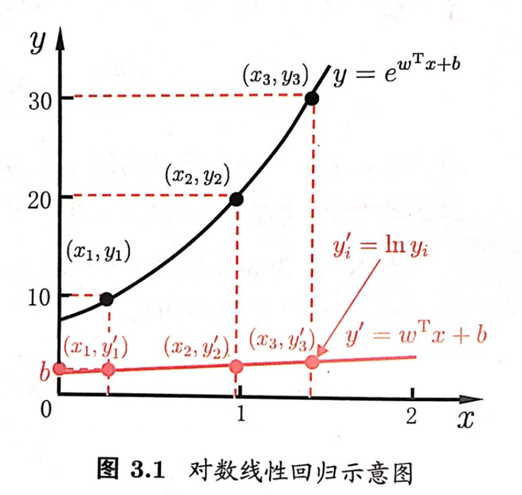

## Chapter3 线性模型

### 基本形式

$\mathbf{x}=(x_1;x_2;...;x_d)$，，其中$x_i$是$\mathbf{x}$在第$i$个属性上的取值，线性模型试图学得一个通过属性的线性组合来进行预测的函数：
$$
f(\mathbf{x})=\omega_1x_1+\omega_2x_2+...+\omega_dx_d+b
$$
一般用向量形式写成:
$$
f(\mathbf{x})=\boldsymbol{\omega}^T\mathbf{x}+b
$$
其中$\boldsymbol{\omega}=(\omega_1;\omega_2;...;\omega_d)$，$\boldsymbol{\omega}和b$学得之后，模型就能够确定

> 线性模型具有很好的**可解释性**，这是因为$\boldsymbol{\omega}$直观地表达了各属性在预测中的重要性

### 线性回归（linear regression）

> 给定数据集$D=\{(\mathbf{x_1,y_1}),(\mathbf{x_2},y_2),...,(\mathbf{x_m},y_m)\}$，其中$\mathbf{x_i}=(x_{i1};x_{i2};...;x_{id})，y_i\in \R$，**线性回归**试图学得一个线性模型以尽可能准确地预测实值输出标记

#### 考虑特殊情况

**考虑输入的属性个数只有一个**，即$D=\{(x_i,y_i)\}_{i=1}^{m}$，其中$x_i\in \R$。对于离散属性，如果属性值之间存在“序”关系，可通过**连续化**将其转化为**连续值**，如果属性之间不存在序关系，假定有k个属性值，通常转化为k维向量，线性回归试图学得：
$$
f(x_i)=\omega x_i+b_i使得f(x_i)\simeq y_i
$$

#### 均方误差

通过让**均方误差**最小化来获得$\omega$和b，即：
$$
(\omega^*,b^*)=\mathop{arg\ min}\limits_{(\omega, b)}\sum_{i=1}^{m}(f(x_i)-y_i)^2\\
=\mathop{arg\ min}\limits_{(\omega,b)}\sum_{i=1}^{m}(y_i-\omega x_i-b)^2
$$
均方误差具有良好的几何意义（**是一个凸函数，可以进行凸函数优化**）

#### 最小二乘法

基于均方误差最小化来进行模型求解的方法称为**最小二乘法**，**最小二乘法**就是试图找到一条直线，使所有样本到直线上的欧氏距离之和最小。求解$\omega$和b使$E_{(w,b)}=\sum_{i=1}^{m}(y_i-\omega x_i-b)^2$最小化的过程，称为线性回归模型的最小二乘**参数估计**，可对上面这个式子分别对$\omega$和b求导：
$$
\cfrac{\partial E_{(\omega,b)}}{\partial b}=2(\omega\sum_{i=1}^{m}x_i^2-\sum_{i=1}^{m}(y_i-b)x_i)\ \ \ \ \  (1)\\
\cfrac{\partial E_{(\omega,b)}}{\partial b}=2(mb-\sum_{i=1}^{m}(y_i-w x_i))\ \ \ \ \ \  \ \ \ \ \ \ (2)
$$
令（1）式和（2）式为0可得到$\omega$和b最优解的闭式解：
$$
\omega=\cfrac{\sum_{i=1}^my_i(x_i-\bar{x})}{\sum_{i=1}^{m}x_i^2-\cfrac{1}{m}(\sum_{i=1}^{m}x_i)^2}\\
b=\cfrac{1}{m}\sum_{i=1}^{m}(y_i-\omega x_i)
$$

#### 多元线性回归

更一般的情况是，对于本章开头描述的数据集D，样本由d个属性描述，此时我们试图学得：
$$
f(\mathbf{x}_i)=\boldsymbol{\omega}^T\mathbf{x}_i+b，使得f(\mathbf{x}_i)\simeq y_i
$$
同样可以使用最小二乘法对$\boldsymbol{\omega}$和b进行估计。

为方便，将$\boldsymbol{\omega}$和b吸收入向量形式$\hat{\boldsymbol{\omega}}=(\boldsymbol{\omega};b)$，同时将数据集D表示为一个mx(d+1)大小的矩阵$\mathbf{X}$，其中每行对应于一个示例，该行前d个元素对应于示例的d个属性值，最后一个元素恒置为1，即：
$$
\mathbf{X}=
\begin{pmatrix}
x_{11} & x_{12} & \cdots & x_{1d} & 1\\
x_{21} & x_{22} & \cdots & x_{2d} & 1\\
\vdots & \vdots & \ddots & \vdots & \vdots \\
x_{m1} & x_{m2} & \cdots & x_{md} & 1
\end{pmatrix}=
\begin{pmatrix}
\mathbf{x}_1^T & 1\\
\mathbf{x}_2^T & 1\\
\vdots & \vdots\\
\mathbf{x}_m^T & 1\\
\end{pmatrix}
$$
再把标记也写成向量形式$\mathbf{y}=(y_1;y_2;...;y_m)$，则有：
$$
\hat{\boldsymbol{\omega}}^*=\mathop{arg\ min}\limits_{\hat{\boldsymbol{\omega}}}(\mathbf{y}-\mathbf{X}\hat{\boldsymbol{\omega}})^T(\mathbf{y}-\mathbf{X}\hat{\boldsymbol{\omega}})
$$
令$E_{\hat{\boldsymbol{\omega}}}=(\mathbf{y}-\mathbf{X}\hat{\boldsymbol{\omega}})^T(\mathbf{y}-\mathbf{X}\hat{\boldsymbol{\omega}})$,对$\hat{\boldsymbol{\omega}}$求导得到：
$$
\cfrac{\partial E_{\hat{\boldsymbol{\omega}}}}{\partial \hat{\boldsymbol{\omega}}}
=2\mathbf{X}^T(\mathbf{X}\hat{\boldsymbol{\omega}-\mathbf{y}})
\ \ \ \ (3)
$$
令上式为0可以得到$\hat{\boldsymbol{\omega}}$最优解的闭式解，由于涉及矩阵逆的计算，比单变量情形更复杂一下，做以下简单的讨论：

* 当$\mathbf{X}^T\mathbf{X}$为满秩矩阵或正定矩阵时，令式（3）为零可得：
  $$
  \hat{\boldsymbol{\omega}}=(\mathbf{X}^T\mathbf{X})^{-1}\mathbf{X^T}\mathbf{y}
  $$

* 现实任务中$\mathbf{X}^T\mathbf{X}$往往不是满秩的，因为在许多任务中会遇到大量的变量，其数目甚至超过样例，导致$\mathbf{X}$的列数多于行数，此时为解出多个$\hat{\boldsymbol{\omega}}$，它们均能使均方误差最小化，选择哪一个将有学习算法的归纳偏好决定，常见的做法是引入正则化

#### 对数线性回归

$$
\ln y=\boldsymbol{\omega}^T\mathbf{x}+b
$$

上式实际上是在求取输入空间到输出空间的非线性函数映射，如图所示，这里的对数函数起到了将线性回归模型的预测值与真实标记联系起来的作用：

更一般地，考虑单调可微函数$g(·)$，令：
$$
y=g^{-1}(\boldsymbol{\omega}^T\mathbf{x+b})
$$
这样得到的模型称为**广义线性模型**，函数$g(·)$称为**联系函数**

### 对数几率回归

如何做分类任务：找到一个单调可微函数将分类任务的真实标记y与线性回归模型的预测值联系起来

#### 二分类任务

需要将线性回归模型产生的预测值$z=\boldsymbol{\omega}^T+b$这一**实值**转换为0/1值，需要用到**单位阶跃函数**
$$
y=\left \{
\begin{aligned}
0, & z < 0;\\
0.5, & z = 0;\\
1, & z > 0.
\end{aligned}
\right.
$$
如图所示为**单位阶跃函数与对数几率函数**

由于单位阶跃函数不连续，因此我们用单调可微的**对数几率函数**（logistic function）来代替：
$$
y=\cfrac{1}{1+e^{-z}}
$$
对数几率函数是一种**sigmoid**函数，它将z值转化为一个接近0或1的y值，并且其输出值在z=0附近变化很陡，将对数几率函数作为$g^{-}(·)$代入，得到：
$$
y=\cfrac{1}{1+e^{-(\boldsymbol{\omega}^T\mathbf{x}+b)}}\ \  \ (4)\\
经变换可得到：
\ln \cfrac{y}{1-y}=\boldsymbol{\omega}^T\mathbf{x}+b\ \ \ \ \ (5)
$$
若将y视为样本$\mathbf{x}$作为正例的可能性，则1-y是其反例的可能性，两者的比值$\cfrac{y}{1-y}$称为**几率**，反映了$\mathbf{x}$作为正例的相对可能性，对几率取对数则得到**对数几率**(log odds，亦称logit)$\ln\cfrac{y}{1-y}$

#### 确定$\omega$和b的值

首先将（4）式中的y视为类后验概率估计$p(y=1|\mathbf{x})$，则（5）式可以重写为
$$
\ln \cfrac{p(y=1|\mathbf{x})}{p(y=0|\mathbf{x})}=
\boldsymbol{\omega}^T\mathbf{x}+b\\
显然有:p(y=1|\mathbf{x})=\cfrac{e^{\boldsymbol{\omega}^T\mathbf{x}+b}}{1+e^{\boldsymbol{\omega}^T\mathbf{x}+b}}\\
p(y=1|\mathbf{x})=\cfrac{1}{1+e^{\boldsymbol{\omega}^T\mathbf{x}+b}}
$$
可以使用**极大似然估计**来估计$\omega$和b，给定数据集$\{(\mathbf{x}_i,y_i)\}_{i=1}^{m}$，对率回归模型最大化**对数似然**为：
$$
\ell(\boldsymbol{\omega},b)=\sum_{i=1}^{m}\ln p(y_i|\mathbf{x}_i;\boldsymbol{\omega},b)\ \ \ \ \ \ (6)
$$
即令每个样本属于其真实标记的概率越大越好。为便于讨论，令$\beta=(\boldsymbol{\omega};b)$，$\hat{\mathbf{x}}=(\mathbf{x};1)$，则$\boldsymbol{\omega}^T\mathbf{x}+b$可以简写成$\beta^T\hat{\mathbf{x}}$。再令$p_1(\hat{\mathbf{x}};\beta)=p(y=1|\hat{\mathbf{x}};\beta), p_0(\hat{\mathbf{x}};\beta)=p(y=0|\hat{\mathbf{x}};\beta)=1-p_1(\hat{\mathbf{x}};\beta)$，则（6）中的似然项就可以重写为：
$$
p(y_i|\mathbf{x}_i;\boldsymbol{\omega},b)=y_ip_1(\hat{\mathbf{x}};\beta)+(1-y_i)p_0(\hat{\mathbf{x}};\beta)\ \ \ \ \ (7)
$$
将（7）式代入到（6）式中，（6）式等价于最小化：
$$
\ell(\beta)=\sum_{i=1}^{m}(-y_i\beta^T\hat{\mathbf{x}}_i+\ln(1+e^{\beta^T\hat{\mathbf{x}}_i}))\ \ \ \ (8)
$$
(8)式式关于$\beta$的高阶可导连续凸函数，根据凸优化理论，经典的数值优化算法如**梯度下降法**和**牛顿法**等都可求得其最优解，于是得到：
$$
\beta^*=\mathop{arg\ min}\limits_{\beta} \ell(\beta)
$$

### 线性判别分析

### 多分类学习

### 类别不平衡问题