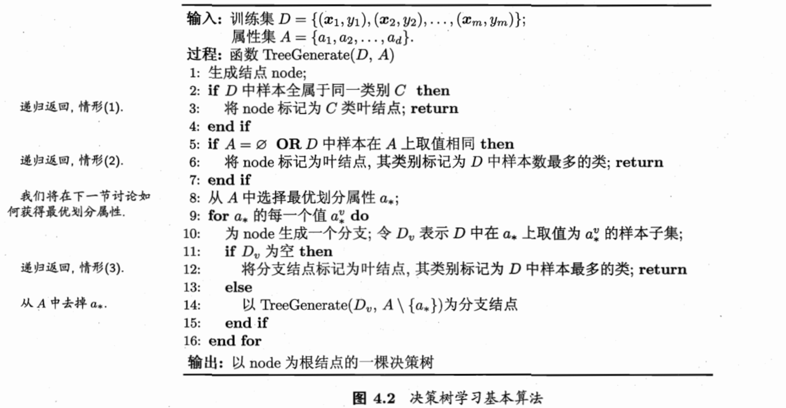

## chapter4 决策树

### 基本原理

* 决策树是一棵多叉判定树

* 一棵树包含一个根节点、若干个内部节点和若干个叶子结点
* 叶子节点对应决策结果、其余每个结点对应一个属性测试
* 每个结点包含的样本集合根据属性测试结果被划分到子结点中
* 根节点包含样本全集
* 从根节点到每个叶节点的路径对应了一个判定测试序列

#### 算法流程

**递归建树、分而治之**

### 划分选择

#### 信息增益

用**信息熵**来度量样本集合纯度，值越小，表示样本集合D的纯度越高
$$
Ent(D)=-\sum_{k=1}^{|\mathcal{Y}|}p_klog_2p_k
$$
**信息增益**

用离散属性a对样本集D进行划分，$D^v$表示第v个分支结点包含了D中所有在属性a上取值为$a^v$的样本

信息增益越大，意味着使用属性a来进行划分所会获得的**纯度提升**越大
$$
Gain(D,a)=Ent(D)-\sum_{v=1}^{V}\cfrac{|D^v|}{|D|}Ent(D^v)
$$

#### 信息增益率

> 信息增益对取值数目较多的属性有所偏好
>
> 信息增益率对可取值数目较少的属性有所偏好

增益率定义：
$$
Gain\_ratio(D,a)=\cfrac{Gain(D,a)}{IV(a)}\\
其中\ \ \ \ IV(a) = -\sum_{v=1}^{V}\cfrac{|D^v|}{|D|}\log_2\cfrac{|D^v|}{|D|}
称为属性a的固有值，其可能取值数目越多（V越大）\\IV（a）的值通常越大
$$
启发式方法：先从候选划分属性中找出信息增益高出平均水平的属性，再从中选择增益率最高的

#### 基尼系数

基尼系数反映了从数据集D中随机抽取两个样本，其类别标记不一致的概率，因此基尼系数越小，数据集D的纯度越高

**基尼值**
$$
Gini(D)=\sum_{k=1}^{|\mathcal{Y}|}\sum_{k^{'}\neq k}p_kp_{k^{'}}\\
=1-\sum_{k=1}^{|\mathcal{Y}|}p_k^2
$$
**基尼系数**
$$
Gini\_index(D,a)=\sum_{v=1}^{V}\cfrac{|D^v|}{|D|}Gini(D^v)
$$

### 剪枝处理

目的：防止**过拟合**

#### 预剪枝

* 在决策树生成过程中，对每个结点在划分前先进行估计
* 若当前节点的划分不能带来决策树泛化性能的提升，则停止划分并将当前结点标记为叶结点

#### 后剪枝

* 先从训练集生成一颗完整的决策树
* 自底向上对非叶子节点进行考察
* 若该节点对应的子树替换为叶节点能提升决策树的泛化能力，就将该子树替换为叶子节点

### 连续与缺失值

#### 连续值处理

连续属性离散化技术

最简单的策略：**二分法**

对连续属性a，可以考察包含n-1个元素的候选划分点集合
$$
T_a=\{\cfrac{a^i+a^{i+1}}{2}|1\le i \le n - 1\}
$$
可以像离散属性值一样来考察这些划分点，选取最优的划分点进行样本集合的划分：
$$
Gain(D,a)=\mathop{max}_{t\in T_a} Gain(D,a,t)\\
=\mathop{max}_{t\in T_a}\ Ent(D)-\sum_{\lambda \in\{-,+\}}\cfrac{|D_t^{\lambda}|}{|D|}Ent(D_t^{\lambda})
$$
$Gain(D,a,t)$是样本集D基于划分点t二分后的信息增益，我们选择使$Gain(D,a,t)$最大化的划分点

**注意：与离散属性不同，若当前节点划分属性为连续属性，该属性还可作为其后代结点的划分属性**

#### 缺失值处理

pass

### 多变量决策树

pass