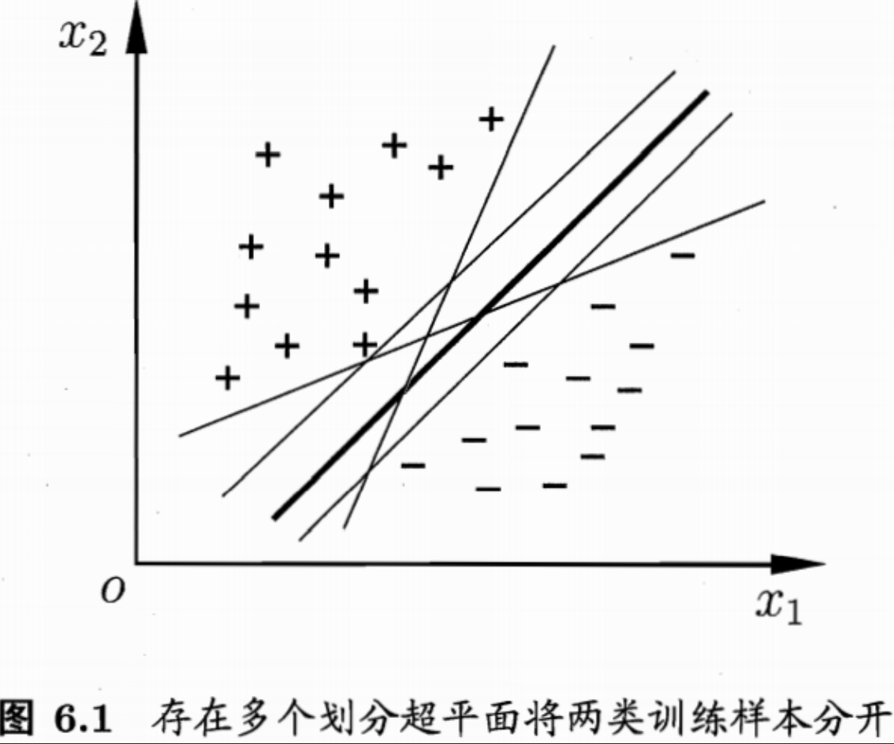
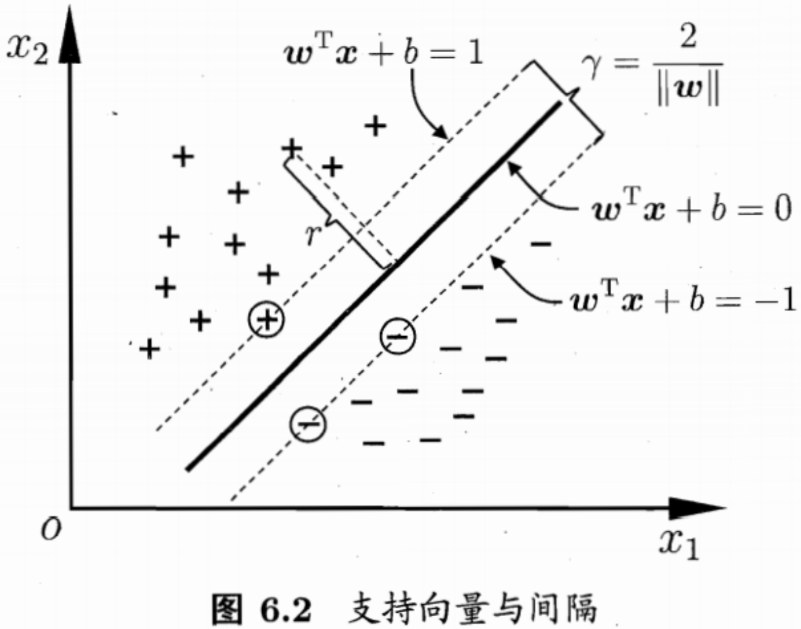
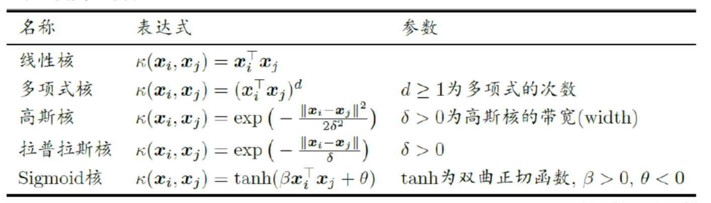
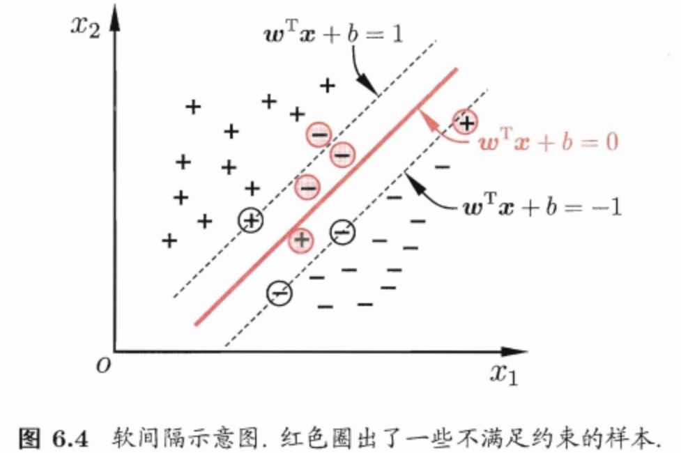
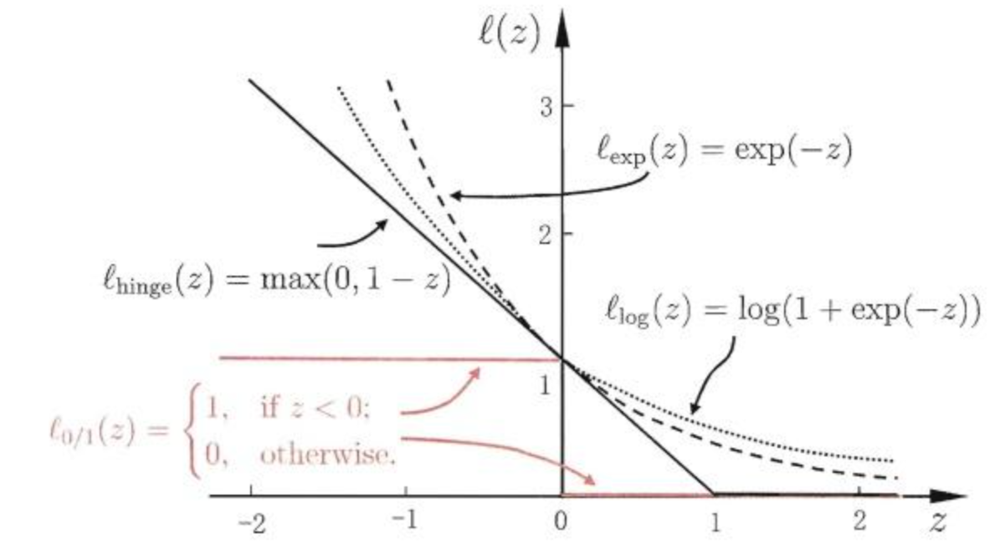

## Chapter6 支持向量机

### 间隔与支持向量

分类学习最基本的想法是基于训练集D在样本空间中找到一个**划分超平面**

如何划分最合适？应该去找位于两类样本**正中间**的划分超平面

划分超平面可通过如下线性方程组来描述：

$\boldsymbol{\omega}=(\omega_1;\omega_2;\omega_3;...;\omega_d)$为法向量，决定了超平面的方向；b为位移项，决定了超平面与原点之间的距离：
$$
\boldsymbol{\omega}^T\mathbf{x}+b=0
$$
**其实上面的公式是一个可以描述任意维度的直线方程！！！！！**

样本空间中任意点$\mathbf{x}$到超平面$(\boldsymbol{\omega},b)$的距离可写为：
$$
r=\cfrac{|\boldsymbol{\omega}^T\mathbf{x}+b|}{||\boldsymbol{\omega}||}
$$
假设超平面$(\boldsymbol{\omega,b})$能将训练样本正确分类，即对于$(\mathbf{x}_i,y_i)\in D$，若$y_i=1$，则有$\boldsymbol{\omega^T}\mathbf{x}+b>0$；若$y_i=-1$，则有$\boldsymbol{\omega}^T\mathbf{x}_i+b<0$，令：
$$
\left \{
\begin{aligned}
\boldsymbol{\omega}^T\mathbf{x}+b \ge +1, & y_i=+1;\\
\boldsymbol{\omega}^T\mathbf{x}+b \le-1, & y_i=-1.
\end{aligned}
\right.\ \ \ \ \ \ \  \ \ \ \ (1)
$$
距离超平面最近的这几个训练样本点使上面约束条件的等号成立，他们被称为**支持向量**，两个异类支持向量到平面的距离之和为：
$$
\gamma=\cfrac{2}{||\boldsymbol{\omega}||}
$$
它被称为**间隔**.

欲找到**最大间隔**的划分超平面，也就是要找到能满足式（1）中约束的参数$\boldsymbol{\omega}$和b，使得$\gamma$最大，即：
$$
\mathop{max}_{\boldsymbol{\omega},b}\ \cfrac{2}{||\boldsymbol{\omega}||}\\
s.t. y_i(\boldsymbol{\omega}^T\mathbf{x}_i+b)\ge1,i=1,2,...,m
$$
为了最大化间隔，仅需要最大化$||\boldsymbol{\omega}||^{-1}$，等价于最小化$||\boldsymbol{\omega}||^2$，即：
$$
\mathop{min}_{\boldsymbol{\omega},b}\cfrac{1}{2}||\boldsymbol{\omega}||^2\\
s.t. y_i(\boldsymbol{\omega}^T\mathbf{x}_i+b)\ge1,i=1,2,...,m\ \ \ \ (2)
$$
以上为支持向量机的基本型.

### 对偶问题

* 式（2）本身是一个凸二次规划问题，可使用拉格朗日乘子法得到其**对偶问题**
* 对拉格朗日函数分别对$\omega$和b求偏导，令偏导为0
* 将偏导为0的代数结果代入到拉格朗日函数得到对偶问题

### 核函数

> 原始样本空间内也许不存在一个能正确划分两类样本的超平面

解决：将样本从原始空间映射到一个更高维的特征空间，使得样本在这个特征空间内线性可分.

在特征空间中划分超平面所对应的模型可表示为：
$$
f(\mathbf{x})=\boldsymbol{\omega}^T\phi(\mathbf{x})+b
$$
对偶问题中涉及$\phi(\mathbf{x}_i)^T\phi(\mathbf{x}_j)$的计算，由于空间维数可能很高，难以计算，因此设想函数：
$$
\kappa(\mathbf{x}_i,\mathbf{x}_j)=<\phi(\mathbf{x}_i),\phi(\mathbf{x}_j)>=\phi(\mathbf{x}_i)^T\phi(\mathbf{x}_j)
$$
函数$\kappa(·,·)$就是**核函数**

常用的核函数：

### 软间隔与正则化

> 显示任务中往往很难确定何时的核函数使得训练样本在特征空间中线性可分

缓解该问题的方法就是允许支持向量机在一些样本上出错

软间隔允许某些样本不满足下面这个约束：
$$
y_i(\boldsymbol{\omega}^T\mathbf{x}_i+b)\ge1
$$
三种常用的替代损失函数（替代0/1损失函数）

* hinge损失：$\ell_{hinge}(z)=max(0,1-z)$
* 指数损失：$\ell_{z}=e^{-z}$
* 对率损失：$\ell(z)=\log(1+e^{-z})$

### 支持向量回归

pass

### 核方法

pass