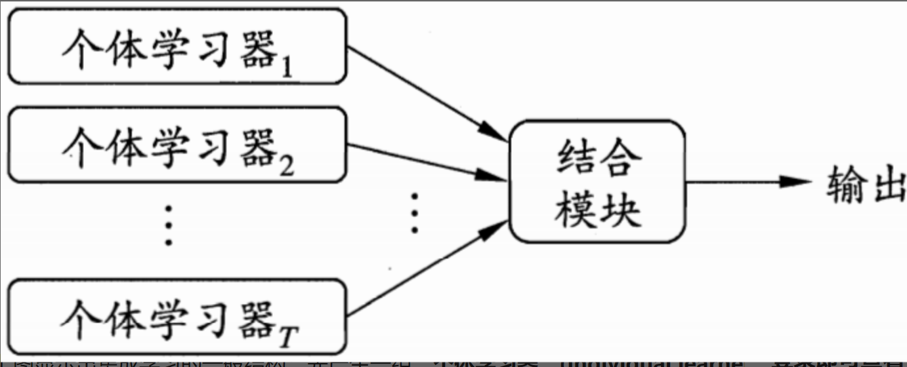
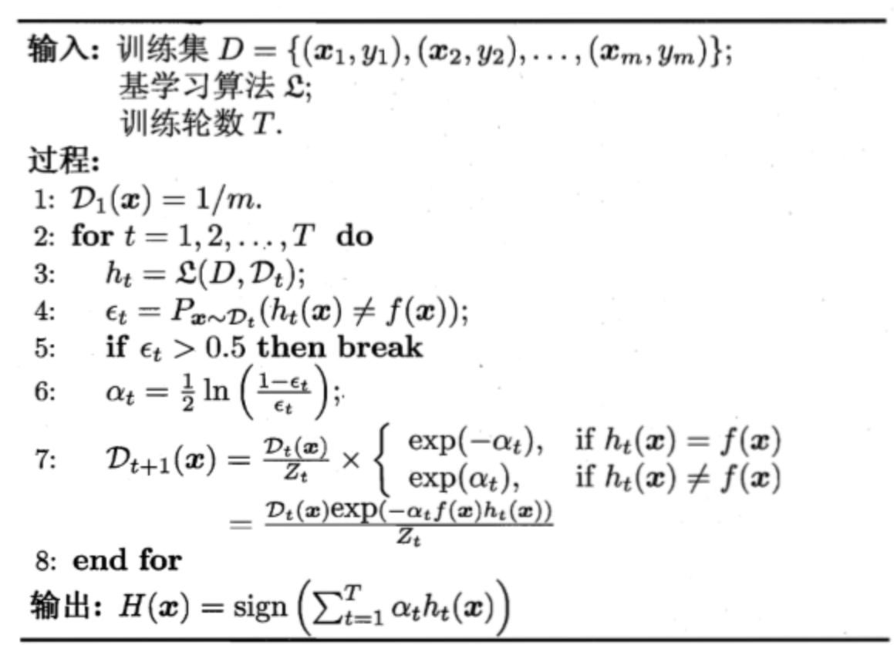
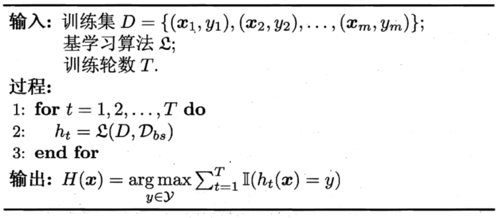
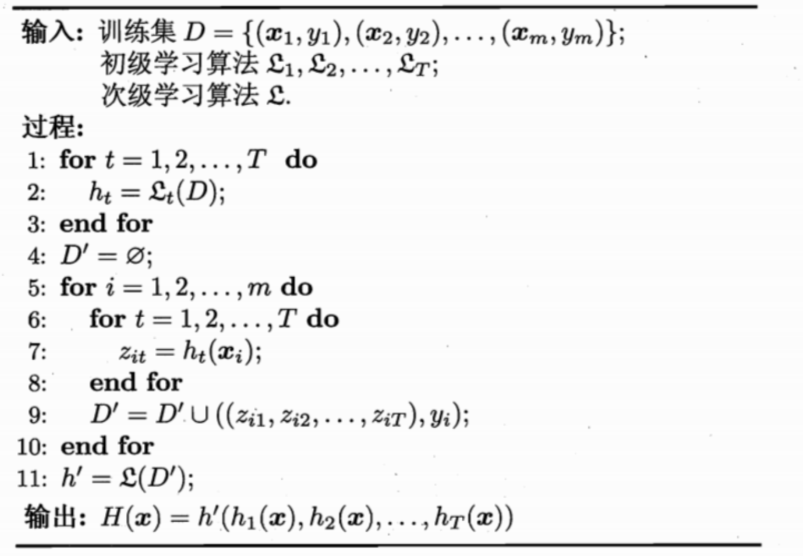

## Chapter8 集成学习

### 个体与集成

> 集成学习通过构建并结合多个学习器来完成学习，有时也被称为多分类器系统、基于委员会的学习

一般结构：先产生一组**个体学习器**，再用某种策略将他们结合起来

集成学习通过将多个学习器进行结合，常可获得比单一学习器显著优于的泛化性能

考虑二分类问题，假定基分类器的错误率为$\epsilon$，即对每个基分类器$h_i$有：
$$
P(h_i(\mathbf{x})\neq f(\mathbf{x}))=\epsilon
$$
假定集成通过简答投票法结合T个基分类器，若有超过半数的基分类器正确，则集成分类就正确：
$$
F(\mathbf{x})=sign(\sum_{i=1}^{T}h_i(\mathbf{x}))
$$
假定基分类器的错误率相互独立，则由Hoeffding不等式可知，集成的错误率为：
$$
P(F(\mathbf{x})\neq f(\mathbf{x}))=\sum_{k=0}^{\lfloor T/2\rfloor}\binom{T}{k}(1-\epsilon)^k\epsilon^{T-k}\leq
exp(-\cfrac{1}{2}T(1-2\epsilon)^2)
$$
上式显示出：随着集成中个体分类器数目T的增大，集成的错误率将指数级下降，最终趋向于零

目前集成学习方法的两大分类：

* 个体学习器间存在强依赖关系、必须串行生成的序列化方法：**Boosting**
* 个体学习器间不存在强依赖关系、可同时生成的并行化方法：**Bagging和随机森林**

### Boosting

Boosting是一族可将弱学习器提升为强学习器的算法

* 从初始训练集训练出一个基学习器
* 根据基学习器的表现调整训练集样本分布，使做错的样本在后续受到更多关注
* 训练下一个基学习器
* 循环...直到基学习器数目达到指定的T个

**AdaBoost算法**

### Bagging与随机森林

使用相互由交叠的采样子集，产生比较好的基学习器，同时保证获得的基学习器具有比较大的差异（尽可能独立）

#### Bagging

**并行式集成学习、基于自主采样法**

**基本流程**：

使用自主采样法，采样出T个含m个训练样本的采样集，然后基于每个采样集训练出一个基学习器，再将这些基学习器进行结合；在对预测输出进行结合时，Bagging通常对分类任务使用简单投票法，对回归任务使用简单平均法。

#### 随机森林

* RF在以决策树为基学习器构建Bagging集成的基础上，进一步在决策树的训练过程中引入了**随机属性选择**

* 随机森林中基学习器的多样性不仅来自样本扰动，还来自属性扰动，这就使得最终集成的泛化性能可通过个体学习器之间差异度的增加而进一步提升
* 随机森林的训练效率常优于Bagging，因为Bagging使用的是**确定型**决策树，而随机森林使用的**随机型**决策树则只需考察一个属性子集

### 结合策略

#### 平均法

对于数值型输出；在个体学习器性能相差较大时宜使用加权平均法，在个体学习器性能相近时宜使用简单平均法。

简单平均法：
$$
H(\mathbf{x})=\cfrac{1}{T}\sum_{i=1}^{T}h_i(\mathbf{x})
$$
加权平均法
$$
H(\mathbf{x})=\sum_{i=1}^Tw_ih_i(\mathbf{x})
$$

#### 投票法

对分类任务来说，将$h_i$在样本$\mathbf{x}$上的预测输出表示为一个N维向量

* 绝对多数投票法：某标记得票过半数，则预测为改标记
* 相对多数投票法：预测为得票最多的标记，若同时有多个标记获最高票，则从中随机选取一个
* 加权投票法：与加权平均法类似

#### 学习法

当训练数据很多时，可以通过另一个学习器来进行结合。这里把个体学习器称为**初级学习器**，用于结合的学习器称为**次级学习器**或**元学习器**

Stacking算法：

### 多样性

#### 误差-分歧分解

针对回归学习任务，对示例$\mathbf{x}$，定义学习器$h_i$的**分歧**为：
$$
A(h_i|\mathbf{x})=(h_i(\mathbf{x})-H(\mathbf{x}))^2
$$
则集成的**分歧**为：
$$
\bar{A}(h|\mathbf{x})=\sum_{i=1}^Tw_iA(h_i|\mathbf{x})\\
=\sum_{i=1}^Tw_i(h_i(\mathbf{x})-H(\mathbf{x}))^2
$$
这里的**分歧**项表征了个体学习器在样本$\mathbf{x}$上的不一致性，即在一定程度上反映了个体学习器的多样性。

E为集成的泛化误差，$\bar{E}$表示个体学习器泛化误差的加权平均值，$\bar{A}$表示个体学习器的加权分歧值：
$$
E=\bar{E}-\bar{A}
$$
上式表明个体学习器准确性越高、多样性越大，则集成越好

#### 多样性度量

|          | $h_i=+1$ | $h_i=-1$ |
| -------- | -------- | -------- |
| $h_j=+1$ | a        | c        |
| $h_j=-1$ | b        | d        |

a表示$h_i和h_j$均预测为正类的样本数目，a+b+c+d=m

* 不合度量
  $$
  dis_{ij}=\cfrac{b+c}{m}
  $$

* 相关系数
  $$
  \rho_{ij}=\cfrac{ad-bc}{\sqrt{(a+b)(a+c)(c+d)(b+d)}}
  $$

* Q-统计量
  $$
  Q_{ij}=\cfrac{ad-bc}{ad+bc}
  $$

* $\kappa$-统计量
  $$
  \kappa=\cfrac{p_1-p_2}{1-p_2}
  $$
  $p_1$是两个分类器取得一致的概率，$p_2$是两个分类器偶然达成一致的概率

#### 多样性增强

* 数据样本扰动
* 输入属性扰动
* 输出表示扰动
* 算法参数扰动

