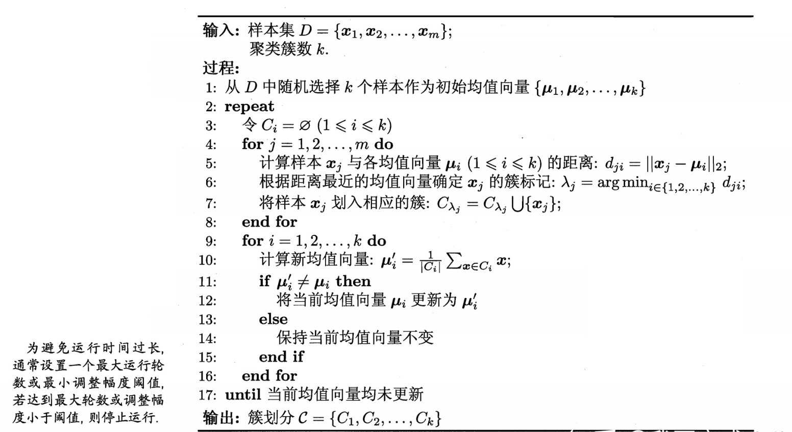
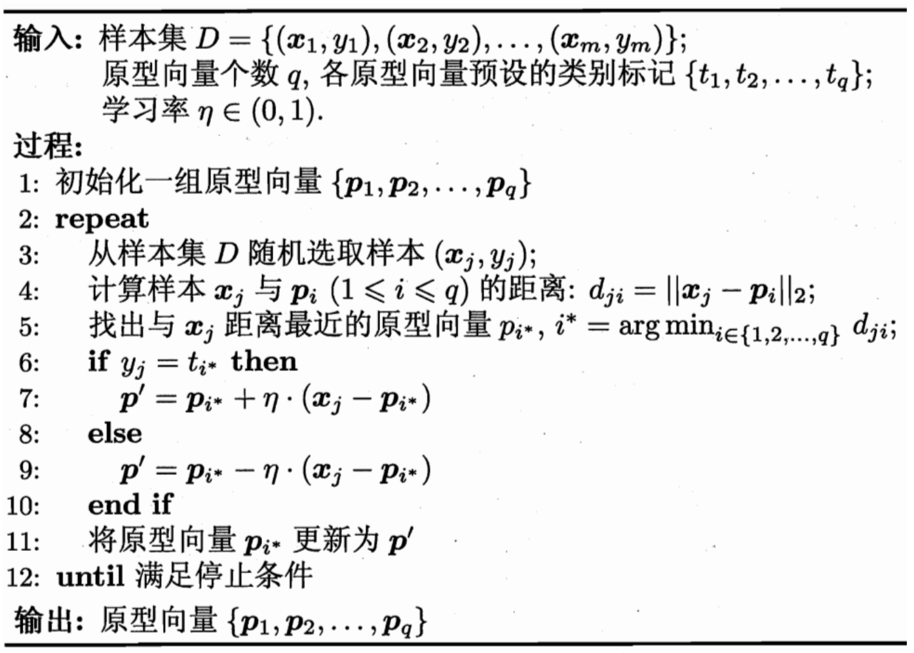
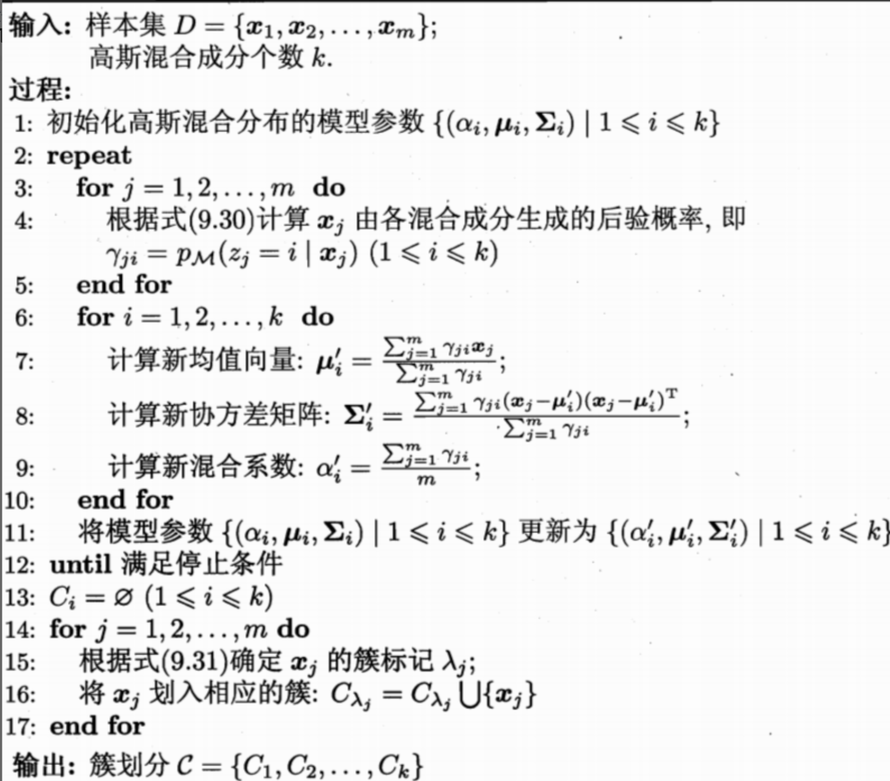
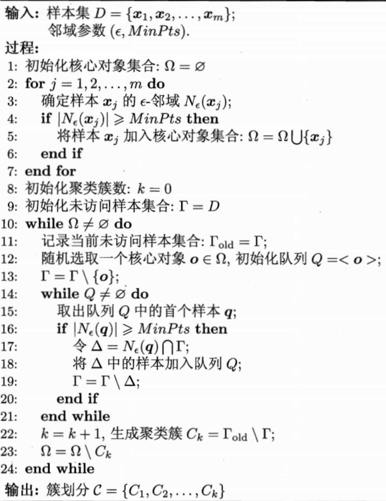
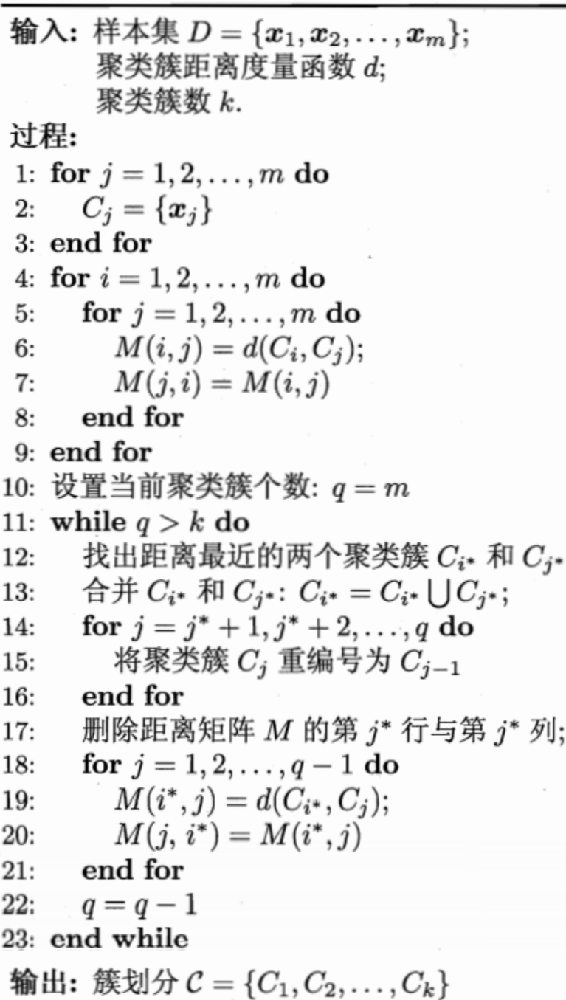

## Chapter9 聚类

### 聚类任务

**无监督学习：**训练样本的标记信息未知，目标是通过对无标记训练样本的学习来揭示数据的内在性质及规律

**聚类：**将数据集中的样本划分为若干个通常是不相交的子集，每个子集称为一个**簇**，聚类过程仅能自动形成簇结构，簇所对应的概念语义需要由使用者来把握和命名

### 性能度量

亦称**有效性指标**，与监督学习中的性能度量作用类似，对于聚类结果，我们需要通过某种性能度量来评估其好坏；同时如果明确了最终要使用的性能度量，则可直接将其作为聚类过程的优化目标

**目标结果**：物以类聚、簇内相似度高，簇间相似度低

性能度量大致分两类：

* 外部指标：将聚类结果与某个“参考模型”进行比较
* 内部指标：直接考察聚类结果而不进行任何参考模型

#### 外部指标

对数据集$D=\{\mathbf{x}_1,\mathbf{x}_2,...,\mathbf{x}_m\}$，假定通过聚类给出的簇划分为$\mathcal{C}=\{C_1,C_2,...,C_k\}$，参考模型给出的簇划分为$\mathcal{C}^*=\{C_1^*,C_2^*,...,C_s^*\}$，相应的，令$\boldsymbol{\lambda}与\boldsymbol{\lambda}^*$分别表示$\mathcal{C}和\mathcal{C}^*$对应的簇标记向量，将样本两两配对考虑，定义:
$$
a=|SS|,SS=\{(\mathbf{x}_i,\mathbf{x}_j)|\lambda_i=\lambda_j,\lambda_i^*\neq\lambda_j^*,i<j\}
\\b=|SD|
\\c=|DS|
\\d=|DD|
\\由于每个样本对仅能出现在一个集合中，因此有\\
c+b+c+d=\cfrac{m(m-1)}{2}
$$
基于上述公式可导出以下常用的聚类性能度量外部指标：

* Jaccard系数
  $$
  JC=\cfrac{a}{a+b+c}
  $$

* FM指数
  $$
  FMI=\sqrt{\cfrac{a}{a+b}·\cfrac{a}{a+c}}
  $$

* Rand指数
  $$
  RI=\cfrac{2(a+d)}{m(m-1)}
  $$

上述性能度量结果值均在$[0,1]$区间，值越大越好

#### 内部指标

考虑聚类结果的簇划分$\mathcal{C}=\{C_1,C_2,...,C_k\}$，定义：
$$
avg(C)=\cfrac{2}{|C||C-1|}\sum_{1\le i\le j\le|C|}dist(\mathbf{x}_i,\mathbf{x}_j)
\\diam(C)=\mathop{max}_{1\le i \le j \le |C|}dist(\mathbf{x}_i, \mathbf{x}_j)
\\d_{min}(C_i,C_j)=\mathop{min}_{\mathbf{x}_i\in C_i,\mathbf{x}_j \in C_j}dist(\mathbf{x}_i,\mathbf{x}_j)\\
d_{cen}(C_i,C_j)=dist(\boldsymbol{\mu}_i,\boldsymbol{\mu}_j)
$$
其中，dist用于计算两个样本之间的距离；$\mu$代表簇C的中心点$\boldsymbol{\mu}=\cfrac{1}{|C|}\sum_{1\le i\le |C|}\mathbf{x}_i$；avg（C）对应于簇C内样本间的平均距离，diam(C)对应于簇C内样本间的最远距离；$d_{min}(C_i,C_j)$对应于簇$C_i和C_j$最近样本间的距离，$d_{cen}(C_i,C_j)$对应于两个簇中心点的距离

基于上述公式可导出下面这些常用的聚类性能度量内部指标：

* DB指数
  $$
  DBI=\cfrac{1}{k}\sum_{i=1}^{k}\mathop{max}_{j\ne i}(\cfrac{avg(C_i)+avg(C_j)}{d_{cen}(C_i,C_j)})
  $$

* Dunn指数
  $$
  DI=\mathop{min}_{1 \le i\le k}\{\mathop{min}_{j\ne i}(\cfrac{d_{min}(C_i,C_j)}{max_{1 \le l \le k}diam(C_l)})\}
  $$
  显然，DBI的值越小越好，而DI则相反，值越大越好

### 距离计算

函数$dist(·,·)$是一个距离度量，需要满足：

* 非负性：$dist(x_i,x_j)\ge 0$
* 同一性：$dist(x_i,x_j)=0当且仅当x_i\ne x_j$
* 对称性：$dist(x_i,x_j)=dist(x_j,x_i)$
* 直递性：$dist(x_i,x_j)\le dist(x_i,x_k) + dist(x_k,x_j)$

给定样本$\mathbf{x}_i和\mathbf{x}_j$最常用的是“闵可夫斯基距离”，用于**有序属性**
$$
dist_{mk}(\mathbf{x}_i,\mathbf{x}_j)=(\sum_{u=1}^n|x_{iu}-x_{ju}|^p)^{\cfrac{1}{p}}
$$
当p=2的时候，闵可夫斯基距离即欧氏距离：
$$
dist_{ed}(\mathbf{x}_i,\mathbf{x}_j)=||\mathbf{x_i}-\mathbf{x}_j||_2=\sqrt{\sum_{u=1}^n|x_{iu}-x_{ju}|^2}
$$
当p=1时，闵可夫斯基距离即曼哈顿距离：
$$
dist_{man}(\mathbf{x}_i,\mathbf{x}_j)=||\mathbf{x}_i-\mathbf{x}_j||_1=\sum_{u=1}^n|x_{iu}-x_{ju}|
$$
对无序属性可采用VDM，令$m_{u,a}表示在属性u上取值为a的样本数，m_{u,a,i}$表示在第i个样本簇中在属性u上取值为a的样本数，k为样本簇数（样本类别已知时k通常设置为类别数），则属性u上两个离散值a与b之间的VDM距离：
$$
VDM_p(a,b)=\sum_{i=1}^k|\cfrac{m_{u,a,i}}{m_{u,a}}-\cfrac{m_{u,b,i}}{m_{u,b}}|^p
$$
将闵可夫斯基距离和VDM结合即可处理混合属性，假定有$n_c$个有序属性、$n-n_c$个无序属性，不失一般性，令有序属性排列在无序属性之前：
$$
MinkovDM_p(\mathbf{x}_i,\mathbf{x}_j)=((\mathbf{x}_i,\mathbf{x}_j)=(\sum_{u=1}^{n_c}|x_{iu}-x_{ju}|^p+\sum_{u=n_c+1}^nVDM_p(x_{iu,x_{ju}}))^{\cfrac{1}{p}}
$$
当样本空间中不同属性的重要性不同时，可使用**加权距离**

### 原型聚类

> 此类算法假设聚类结构能通过一组原型刻画，通常算法先对原型进行初始化，然后对原型进行迭代更新求解

#### k均值算法

针对聚类所得簇划分$\mathcal{C}=\{C_1,C_2,...,C_k\}$最小化平方误差
$$
E=\sum_{i=1}^k\sum_{\mathbf{x} \in C_i}||\mathbf{x}-\boldsymbol{\mu}_i||_2^2\\
其中 \boldsymbol{\mu}_i=\cfrac{1}{|C_i|}\sum_{\mathbf{x}\in C_i}\mathbf{x}是簇C_i的均值向量
$$
最小化上式并不容易，这是一个NP难问题，k均值算法采用了贪心策略，通过迭代优化来近似求解上式。算法流程如下：

#### 学习向量量化

> 同样试图找到一种原型向量来刻画聚类结构，但与一般聚类算法不同的是，LVQ假设数据样本带有类别标记，学习过程利用样本的这些监督信息来辅助分类

算法描述如下：

#### 高斯混合聚类

> 采用概率模型来表达聚类原型

对n维样本空间$\mathcal{X}$中的随机向量$\mathbf{x}$，若$\mathbf{x}$服从高斯分布，其概率密度函数为：
$$
p(\mathbf{x})=\cfrac{1}{(2\pi)^{\cfrac{n}{2}}|\sum|^{\cfrac{1}{2}}}e^{-\cfrac{1}{2}(\mathbf{x} - \boldsymbol{\mu})^T\sum^{-1}(\mathbf{x}-\boldsymbol{\mu})}
$$
其中$\boldsymbol{\mu}$是n维均值向量，$\sum$是nxn的协方差矩阵，高斯分布完全由均值向量$\boldsymbol{\mu}$和协方差矩阵$\sum$这两个参数确定

#### 密度聚类

> 此类算法假设聚类结构能通过样本分布的紧密程度确定，通常情况下密度聚类算法从样本密度的角度考察样本之间的可连接性，并基于可连接样本不断扩展聚类簇宜获得最终的聚类效果

DBSCAN是一种著名的密度聚类算法，他基于一组“邻域”参数$(\epsilon,MinPts)$来刻画样本分布的紧密程度。

该算法将簇定义为：由**密度可达**关系导出的最大的**密度相连**样本集合。形式化的说，给定邻域参数$(\epsilon, MinPts)$，簇$C\subseteq D$是满足以下性质的非空样本子集：
$$
连接性：\mathbf{x}_i\in C,\mathbf{x}_j \in C\Rightarrow \mathbf{x}_i与\mathbf{x}_j密度相连
\\ 最大性：\mathbf{x}_i \in C,\mathbf{x}_j由\mathbf{x}_i密度可达 \Rightarrow\mathbf{x}_j \in C
$$
实际上，若$\mathbf{x}$为核心对象，由$\mathbf{x}$密度可达的所有样本组成的集合记为$X=\{\mathbf{x}^{'}\in D|\mathbf{x}^{'}由\mathbf{x}密度可达\}$，则不难证明X即为满足连接性与最大性的簇

**算法描述：**

#### 层次聚类

> 该算法试图在不同层次上对数据集进行划分，从而形成树状的聚类结构，数据集的划分可采用**自底向上**的聚合策略，也可采用**自顶向下**的分拆策略

AGNES是一种采用自底向上聚合策略的层次聚类算法，它先将数据集中的每个样本看作一个初始聚类簇，然在算法运行的每一步中找出距离最近的两个聚类簇进行合并，该过程不断重复，直至达到预设的聚类簇个数。这里的关键是如何卷积计算聚类簇之间的距离，给定聚类簇$C_i和C_j$可通过下面的式子来计算距离：
$$
最小距离: d_{min}(C_i,C_j)=\mathop{min}_{\mathbf{x}\in C_i,\mathbf{z}\in C_j}dist(\mathbf{x}, \mathbf{z})
\\最大距离: d_{max}(C_i,C_j)=\mathop{max}_{\mathbf{x}\in C_i,\mathbf{z}\in C_j} dist(\mathbf{x},\mathbf{z})
\\平均距离: d_{avg}(C_i,C_j)=\cfrac{1}{|C_i||C_j|}\sum_{\mathbf{x}\in C_i}\sum_{\mathbf{z}\in C_j}dist(\mathbf{x},\mathbf{z})
$$
最小距离由两个簇的最近样本决定——单链接算法

最大距离由两个簇的最远样本决定——全链接算法

平均距离由两个簇的所有样本共同决定——均链接算法

